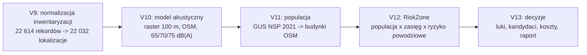

# Metodyka wyliczania zasięgu syren SOIA

**Data opracowania:** 11 maja 2026 r.
**Zakres:** techniczne uzasadnienie sposobu wyliczania zasięgów syren w projekcie SOIA.
**Podstawa projektu:** pipeline V9-V13, w szczególności V9 (normalizacja), V10 (model akustyczny OSM), V11 (populacja), V12/V13 (ryzyko i decyzje).

## 1. Cel dokumentu

Celem dokumentu jest opisanie, jak w projekcie SOIA wyznaczany jest zasięg akustyczny syren alarmowych, jakie prawa fizyki stoją za modelem, jakie są warunki brzegowe, jak działa algorytm oraz jakie artefakty projektu potwierdzają poprawność i audytowalność podejścia.

Najważniejsza teza metodyczna: model SOIA jest **inżynierskim modelem planistycznym** dla skali kraju. Daje spójne, replikowalne i porównywalne wyniki dla 22 032 aktywnych lokalizacji syren, ale nie zastępuje certyfikowanego pomiaru terenowego ani pełnego solvera propagacji akustycznej klasy ATDI/HTZ, SoundPLAN, CadnaA lub IMMI.

## 2. Miejsce modelu zasięgu w pipeline



Model zasięgu powstaje w dwóch krokach:

1. **V9 free-field:** przypisanie profilu SPL do każdej syreny i policzenie teoretycznych izofon w przestrzeni wolnej.
2. **V10 OSM:** przeliczenie pola dźwięku na rastrze 100 m z lokalnym tłumieniem wynikającym z zabudowy i clutteru OSM.

Kluczowe skrypty:

| Etap | Skrypt | Rola |
|---|---|---|
| V9 | `scripts/build_siren_sound_profiles_and_theoretical_ranges.py` | profile SPL, promienie teoretyczne, izofony free-field |
| V10 | `scripts/extract_osm_layers_for_sound_model.py` | budynki, clutter i drogi z OSM w EPSG:2180 |
| V10 | `scripts/build_siren_osm_attenuated_ranges_v10.py` | raster 100 m, tłumienie OSM, klasy 65/70/75 dB(A), poligony |
| V11 | `scripts/disaggregate_gus_population_to_buildings_v11.py` | populacja GUS przypisana do budynków i zasięgów |

## 3. Dane wejściowe do modelu zasięgu

| Warstwa | Źródło | Użycie w modelu |
|---|---|---|
| Inwentaryzacja syren | `ankieta-pobrana/inwentaryzacja-syren-2026-05-05.csv` | lokalizacja, typ, moc, wysokość montażu, właściciel, łączność |
| Finalny CSV V9 | `analysis-output/.../inwentaryzacja-syren-2026-05-05.normalized.analysis.final.V9.csv` | źródło punktów i profili dla V10 |
| Budynki OSM | `analysis-output/.../osm_sound_layers_PL_2180/osm_buildings_PL_2180_part*.shp` | kara komórkowa za zabudowę |
| Clutter OSM | `analysis-output/.../osm_sound_layers_PL_2180/osm_clutter_PL_2180_part*.shp` | lokalna kara dB zależna od klasy pokrycia terenu |
| Drogi OSM | `analysis-output/.../osm_sound_layers_PL_2180/osm_roads_PL_2180.shp` | warstwa referencyjna, w V10 bez redukcji tłumienia |
| CRS roboczy | EPSG:2180 | metryczny układ PUWG 1992 dla Polski |

Liczby kontrolne:

| Element | Wartość |
|---|---:|
| Rekordy źródłowe V9 | 22 614 |
| Aktywne lokalizacje po deduplikacji | 22 032 |
| Grupy duplikatów współrzędnych | 537 |
| Rekordy w grupach duplikatów | 1 119 |
| Syreny analogowe przeliczone SAD -> DSE | 14 629 |
| Budynki OSM wyekstrahowane | 17 721 895 |
| Clutter OSM wyekstrahowany | 5 303 464 |
| Budynki OSM użyte w rastrze V10 | 17 721 853 |
| Clutter OSM użyty w rastrze V10 | 4 996 016 |

## 4. Zasady fizyczne i akustyczne

### 4.1. Poziom dźwięku w dB(A)

Model operuje na poziomie ciśnienia akustycznego `Lp` wyrażonym w dB(A). Skala decybelowa jest logarytmiczna. Dla ciśnienia akustycznego stosuje się zależność z mnożnikiem 20, ponieważ ciśnienie jest wielkością amplitudową:

```text
Lp = 20 * log10(p / p0)
```

gdzie `p0 = 20 µPa` jest standardowym progiem odniesienia dla dźwięku w powietrzu. Oznaczenie `(A)` wskazuje ważenie A, czyli przybliżenie czułości ludzkiego słuchu.

### 4.2. Rozchodzenie fali w przestrzeni wolnej

Podstawą modelu jest sferyczne rozchodzenie się fali akustycznej. W idealnej przestrzeni wolnej energia rozkłada się na coraz większej powierzchni sfery, dlatego natężenie maleje z kwadratem odległości, a poziom ciśnienia akustycznego maleje logarytmicznie.

W projekcie SOIA przyjęto wzór:

```text
Lp(r) = SPL30 - 20 * log10(r / 30)
```

gdzie:

| Symbol | Znaczenie |
|---|---|
| `Lp(r)` | poziom dźwięku w komórce rastra w odległości `r` od syreny |
| `SPL30` | poziom dźwięku syreny w odległości 30 m |
| `r` | odległość pozioma od syreny do środka komórki rastra, w metrach |
| `30` | odległość referencyjna profilu SPL |

Odwrócenie wzoru daje promień do progu `T`:

```text
r(T) = 30 * 10 ^ ((SPL30 - T) / 20)
```

W implementacji odległość używana do strat jest ograniczona od dołu:

```text
dist_for_loss = max(dist, 30 m)
```

To usuwa osobliwość logarytmu w punkcie źródła i oznacza, że w promieniu 30 m model nie przypisuje poziomu większego niż `SPL30`.

### 4.3. Progi słyszalności

Model klasyfikuje komórki rastra do progów:

| Próg | Znaczenie operacyjne |
|---:|---|
| 65 dB(A) | próg podstawowej słyszalności alarmu, referencyjny dla pokrycia krajowego |
| 70 dB(A) | warunki trudniejsze, wyższe tło miejskie lub dzienne |
| 75 dB(A) | warunki bardzo wymagające, silne tło komunikacyjne lub przemysłowe |

W rastrze V10 klasy `65`, `70`, `75` są niedublujące. Komórka ma jedną klasę, odpowiadającą najwyższemu przekroczonemu progowi. W tabelach populacyjnych wartości `>=65`, `>=70`, `>=75` są już wartościami kumulatywnymi.

## 5. Profile mocy syren

V10 stosuje cztery profile mocy odpowiadające klasom DSE. Dla każdej syreny profil jest wybierany według pola `moc_w` z finalnego CSV V9.

| Klasa profilu | `SPL30` | Promień do 65 dB(A) z samego wzoru | Promień do 70 dB(A) | Promień do 75 dB(A) | `calc_rad` zapisany w profilu |
|---:|---:|---:|---:|---:|---:|
| 300 W | 103 dB(A) | 2 383 m | 1 340 m | 754 m | 3 000 m |
| 600 W | 109 dB(A) | 4 755 m | 2 674 m | 1 504 m | 5 000 m |
| 900 W | 112 dB(A) | 6 716 m | 3 777 m | 2 124 m | 7 000 m |
| 1 200 W | 115 dB(A) | 9 487 m | 5 335 m | 3 000 m | 10 000 m |

Uwaga interpretacyjna: promienie z kolumn `r65_m`, `r70_m`, `r75_m` są liczone wzorem akustycznym i to one sterują oknem obliczeń. Pole `calc_rad` jest przechowywanym promieniem profilu referencyjnego/katalogowego.

## 6. Sprowadzenie syren SAD do profili DSE

Syren analogowych SAD nie wolno porównywać z cyfrowymi DSE wyłącznie po mocy elektrycznej silnika, ponieważ moc silnika w kW nie przekłada się liniowo na poziom SPL ani na zasięg alarmu. Projekt używa porównania po zasięgu i SPL.

Przyjęte mapowanie:

| Typ SAD | Odpowiednik cyfrowy używany w modelu |
|---|---:|
| SAD-1,5 kW | DSE 300 W |
| SAD-3 kW | DSE 900 W |
| SAD-4 kW | DSE 900 W |
| SAD-5,5 kW | DSE 1 200 W |

Efekt w finalnym V9:

| Profil po przeliczeniu analogów | Liczba analogowych syren |
|---:|---:|
| 300 W | 753 |
| 900 W | 10 715 |
| 1 200 W | 3 161 |
| **Razem** | **14 629** |

To tłumaczy rozbieżność z kontrolnym plikiem `ATDI/syreny polska ostateczna.KMZ`: KMZ zachowuje stare moce silników SAD, natomiast V9 używa równoważnych profili DSE.

## 7. Algorytm V10 krok po kroku

### 7.1. Przygotowanie punktów

1. Wczytaj finalny CSV V9.
2. Dla każdego rekordu pobierz `lat`, `lon`, `moc_w`, `rodzaj_syreny`, `wysokosc_nad_terenem_m`, `npm_m`, `nr_ref`.
3. Przypisz profil SPL:
   - `moc_w <= 450` -> 300 W,
   - `450 < moc_w <= 750` -> 600 W,
   - `750 < moc_w <= 1050` -> 900 W,
   - `moc_w > 1050` -> 1 200 W.
4. Przelicz punkty z EPSG:4326 do EPSG:2180.
5. Deduplikuj identyczne współrzędne:
   - wygrywa największa `moc_w`,
   - przy remisie wygrywa najniższy `nr_ref`.

### 7.2. Budowa rastra

1. Wyznacz ramkę wszystkich syren w EPSG:2180.
2. Rozszerz ramkę o maksymalny promień `r65_m`.
3. Zbuduj raster 100 m.
4. W V10 wynikowy raster ma:

| Parametr | Wartość |
|---|---:|
| Rozdzielczość | 100 m |
| Szerokość | 7 055 komórek |
| Wysokość | 6 500 komórek |
| Liczba komórek | 45 857 500 |
| BBox EPSG:2180 | `163700, 134300, 869200, 784300` |

### 7.3. Pole free-field i syrena dominująca

Dla każdej syreny model przegląda tylko okno rastra mieszczące się w promieniu `r65_m`. Dla komórek w tym promieniu liczy:

```text
level = SPL30 - 20 * log10(max(dist, 30) / 30)
```

Następnie w każdej komórce przechowywana jest tylko syrena o najwyższym poziomie free-field:

```text
if inside_radius and level > best_level[cell]:
    best_level[cell] = level
    winner[cell] = site_uid
```

Model nie sumuje energii z wielu syren. To jest świadome założenie:

- zapewnia jednoznaczne przypisanie komórki do syreny dominującej,
- eliminuje podwójne liczenie populacji,
- jest konserwatywne w obszarach nakładania, bo rzeczywista superpozycja wielu źródeł może lokalnie podnieść poziom dźwięku.

### 7.4. Tłumienie OSM

Po wyznaczeniu syreny dominującej model odejmuje lokalne kary:

```text
sound[cell] = best_level[cell] - clutter_db[cell] - building[cell] * 10 dB
```

Kara za budynek:

| Warunek | Kara |
|---|---:|
| komórka dotknięta przez budynek OSM | 10 dB |
| brak budynku | 0 dB |

Kary clutter:

| Klasa OSM | Kara dB |
|---|---:|
| residential | 6.0 |
| industrial | 8.0 |
| commercial / retail | 7.0 |
| forest | 10.0 |
| farmland | 1.0 |
| farmyard | 3.0 |
| open_green | 1.5 |
| orchard | 4.0 |
| scrub | 5.0 |
| wetland | 2.0 |
| water | 0.0 |
| bare | 0.5 |
| construction | 5.0 |
| restricted | 5.0 |
| parking | 1.0 |
| public | 5.0 |

Budynki i clutter są rasteryzowane z parametrem `all_touched=True`, więc obiekt dotykający komórki wpływa na komórkę. Jeżeli klasy OSM nachodzą na siebie, V10 rozstrzyga to kolejnością rasteryzacji, nie sumą wszystkich nakładających się klas.

### 7.5. Klasyfikacja progów

Po tłumieniu komórka otrzymuje klasę:

```text
coverage_class = 0
if sound >= 65: coverage_class = 65
if sound >= 70: coverage_class = 70
if sound >= 75: coverage_class = 75
```

Wynik:

| Wartość | Znaczenie |
|---:|---|
| 0 | poza zasięgiem `>=65 dB(A)` |
| 65 | spełnia 65 dB(A), ale nie 70 dB(A) |
| 70 | spełnia 70 dB(A), ale nie 75 dB(A) |
| 75 | spełnia 75 dB(A) lub więcej |

### 7.6. Wektoryzacja

Raster jest kodowany jako:

```text
code[cell] = site_uid * 1000 + coverage_class[cell]
```

Następnie komórki są wektoryzowane do poligonów i rozpuszczane po parach:

```text
(site_uid, db)
```

Dzięki temu wynikowa warstwa zasięgu jest niedublująca przestrzennie. Każdy punkt powierzchni może należeć tylko do jednej syreny dominującej i jednej klasy progu.

## 8. Warunki brzegowe modelu

| Obszar | Warunek brzegowy | Uzasadnienie |
|---|---|---|
| Data inwentaryzacji | stan na 5 maja 2026 r. | zamknięta ankieta źródłowa |
| Układ współrzędnych | EPSG:2180 | metryczne odległości i powierzchnie w Polsce |
| Deduplikacja | identyczne `lat/lon`: największa moc, potem najniższy `nr_ref` | brak podwójnego liczenia współlokowanych syren |
| Odległość minimalna | `max(dist, 30 m)` | stabilność logarytmu i zgodność z referencją SPL30 |
| Odległość maksymalna | promień do 65 dB(A) z profilu SPL | dalej komórka nie może spełnić progu referencyjnego bez tłumienia |
| Rozdzielczość | 100 m | kompromis dokładności i kosztu obliczeń krajowych |
| Syrena w komórce | syrena dominująca free-field | jednoznaczne przypisanie i brak dublowania populacji |
| Tłumienie | lokalne kary OSM po wyborze dominującej syreny | szybki, audytowalny model dla skali kraju |
| Suma źródeł | brak sumowania wielu syren | konserwatywne i niedublujące podejście |
| Wysokość montażu | walidowana i eksportowana, ale nie wchodzi do wzoru V10 | przy rastrze 100 m i zasięgach kilometrowych efekt pionowy jest drugorzędny; pełna geometria 3D wymaga solvera |
| Wysokość n.p.m. | uzupełniona z SRTM, ale nie używana w tłumieniu V10 | przygotowanie danych do kontroli i przyszłego modelu terenowego |
| Pogoda | brak wiatru, brak gradientu temperatury | model średnioplanistyczny, nie scenariusz chwilowy |
| Kierunkowość syren | brak charakterystyki kierunkowej | brak jednolitych danych kierunkowych dla wszystkich urządzeń |
| Odbicia i dyfrakcja | nieuwzględnione jawnie | wymagają pełnego solvera akustycznego |
| Granica kraju | raster wynika z bbox syren, downstream populacja ogranicza analizę do danych GUS/PRG | model akustyczny jest warstwą techniczną, wnioski populacyjne są liczone na polskiej populacji |

## 9. Wyniki V10 potwierdzające podejście

| Metryka | Wynik |
|---|---:|
| Rekordy źródłowe | 22 614 |
| Aktywne lokalizacje po deduplikacji | 22 032 |
| Komórki rastra | 45 857 500 |
| Komórki z pokryciem `>=65 dB(A)` | 23 734 554 |
| Syreny z pokryciem | 20 921 |
| Poligony zasięgu | 61 110 |
| Puste geometrie | 0 |
| Niepoprawne geometrie | 0 |
| Brakujące `nr_ref` | 0 |
| Klasy `db` | 65, 70, 75 |
| `overlap_ratio` | 0.0 |
| `validation_passed` | true |

Powierzchnia klas V10:

| Klasa | Powierzchnia |
|---:|---:|
| 65 dB(A) | 6 865 799 ha |
| 70 dB(A) | 7 168 087 ha |
| 75 dB(A) | 9 700 668 ha |
| **Razem `>=65 dB(A)`** | **23 734 554 ha** |

Porównanie z V9 free-field:

| Model | Powierzchnia sumaryczna |
|---|---:|
| V9 free-field bez OSM | 307 155 535 789,23 m2 |
| V10 po tłumieniu OSM | 237 345 540 000,00 m2 |

Zmniejszenie pokrycia po OSM jest oczekiwanym efektem dodania strat za zabudowę i pokrycie terenu.

## 10. Populacja jako potwierdzenie skutku modelu

V11 nie zmienia zasięgu akustycznego. V11 nakłada na wynik V10 populację GUS NSP 2021, rozprowadzoną na budynki OSM z zachowaniem sumy w każdej komórce 500 m.

Wyniki krajowe:

| Metryka | Noc | Dzień |
|---|---:|---:|
| Populacja GUS ogółem | 38 035 768 | 38 035 768 |
| W zasięgu `>=65 dB(A)` | 29 348 811 | 29 363 904 |
| Poza zasięgiem `>=65 dB(A)` | 8 686 957 | 8 671 864 |

Walidacja V11:

| Sprawdzenie | Wynik |
|---|---|
| suma nocna = GUS `tot` | true |
| suma dzienna = GUS `tot` | true |
| brak ujemnych populacji | true |
| maksymalna różnica per komórka noc | `1.637e-11` |
| maksymalna różnica per komórka dzień | `1.455e-11` |

To potwierdza, że wnioski populacyjne nie wynikają z utraty lub multiplikacji ludności w modelu, lecz z przecięcia populacji z niedublującymi zasięgami V10.

## 11. Dlaczego podejście jest obronne metodycznie

1. **Jest oparte na jawnej fizyce:** spadek `20 * log10(r / r0)` wynika z rozchodzenia fali w przestrzeni wolnej.
2. **Jest replikowalne:** skrypty, wejścia, wyjścia i walidacje są zapisane w repozytorium.
3. **Nie jest czarną skrzynką:** każdy etap ma plik `summary.json`, `validation.json` i raport.
4. **Nie zawyża przez nakładanie syren:** model wybiera dominujące źródło, bez sumowania energii z wielu syren.
5. **Uwzględnia przeszkody terenowe w skali kraju:** budynki i clutter OSM obniżają poziom po free-field.
6. **Daje jednoznaczne przypisanie odpowiedzialności:** każda komórka pokrycia ma jedną syrenę dominującą, co pozwala liczyć populację, luki i rekomendacje.
7. **Rozdziela wynik modelowy od pomiaru:** dokumentacja jasno wskazuje, że model służy do planowania, a nie do certyfikacji terenowej.
8. **Zachowuje sumy populacji:** V11 zachowuje sumę GUS w wariancie nocnym i dziennym.
9. **Jest odporny na duplikaty lokalizacji:** deduplikacja po współrzędnych zapobiega sztucznemu wzrostowi pokrycia.
10. **Jest skalowalny:** raster 100 m pozwala policzyć cały kraj przy kontrolowanym koszcie obliczeń.

## 12. Ograniczenia, które trzeba komunikować wprost

Model V10 nie powinien być przedstawiany jako certyfikowana mapa słyszalności. Najważniejsze ograniczenia:

- brak pełnej analizy linii widzenia,
- brak dyfrakcji na krawędziach budynków i terenu,
- brak odbić od fasad,
- brak wpływu wiatru, temperatury, wilgotności i inwersji,
- brak charakterystyki kierunkowej konkretnych modeli syren,
- brak lokalnego tła akustycznego,
- wysokość montażu i n.p.m. są kontrolowane, ale nie uczestniczą w aktualnym wzorze propagacji,
- wybór syreny dominującej następuje przed tłumieniem OSM, więc w rzadkich przypadkach po tłumieniu inna syrena mogłaby być lokalnie silniejsza,
- overlapping clutter OSM jest rozstrzygany technicznie przez rasteryzację, nie przez pełną klasyfikację akustyczną terenu,
- wynik służy do rankingu i planowania, a lokalizacje inwestycyjne wymagają walidacji terenowej.

Te ograniczenia nie unieważniają modelu. Określają jego klasę: jest to model strategiczny i porównawczy, nie projekt wykonawczy pojedynczej instalacji.

## 13. Artefakty dowodowe w projekcie

| Teza | Artefakt |
|---|---|
| Dane V9 są kompletne po normalizacji | `analysis-output/.../inwentaryzacja-syren-2026-05-05.normalized.analysis.final.V9.validation.json` |
| SAD przeliczono na profile DSE | `analysis-output/.../analog-power-to-digital-equivalent-corrections-summary.V9.json` |
| Wzory SPL i profile są jawne w kodzie | `scripts/build_siren_sound_profiles_and_theoretical_ranges.py` |
| V10 stosuje raster, OSM i progi 65/70/75 | `scripts/build_siren_osm_attenuated_ranges_v10.py` |
| OSM ma jawne klasy tłumienia | `scripts/extract_osm_layers_for_sound_model.py` |
| V10 przeszedł walidację | `analysis-output/.../atdi_sound_model_V10_osm/v10_osm_model_validation.json` |
| Wynik V10 ma raport i liczby kontrolne | `analysis-output/.../atdi_sound_model_V10_osm/v10_osm_model_report.md` |
| V11 zachowuje sumę populacji GUS | `analysis-output/.../population_model_V11/population_model_V11_validation.json` |
| Metodyka jest opisana dla decydenta | `RAPORT_SOIA_2026/TomI_RaportGlowny/R02_metodyka.md` |
| Karta projektu spina V9-V13 | `KARTA_PROJEKTU_SOIA.md` |

## 14. Komenda odtworzeniowa dla V10

```bash
python3 scripts/build_siren_osm_attenuated_ranges_v10.py \
  --points-csv analysis-output/inwentaryzacja-syren-2026-05-05/inwentaryzacja-syren-2026-05-05.normalized.analysis.final.V9.csv \
  --osm-dir analysis-output/inwentaryzacja-syren-2026-05-05/osm_sound_layers_PL_2180 \
  --output-dir analysis-output/inwentaryzacja-syren-2026-05-05/atdi_sound_model_V10_osm \
  --cell-size-m 100 \
  --thresholds 65 70 75
```

## 15. Wniosek końcowy

Podejście SOIA jest możliwe do obrony jako krajowy model planistyczny, ponieważ łączy prosty i uznany mechanizm propagacji free-field z jawnie opisanymi karami terenowymi OSM, pracuje na metrycznym rastrze 100 m, eliminuje podwójne liczenie przez syrenę dominującą, zachowuje pełną ścieżkę audytu i posiada walidację liczbową na etapach V9, V10 i V11.

W komunikacji zewnętrznej należy jednocześnie podkreślać, że wyniki są rekomendacją analityczną do priorytetyzacji inwestycji i integracji, a nie certyfikatem słyszalności konkretnej syreny w konkretnym dniu i warunkach atmosferycznych.
