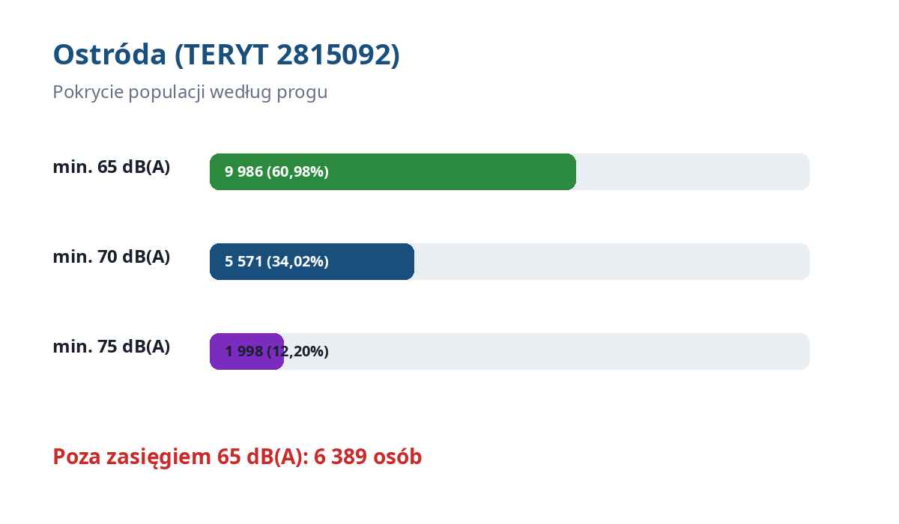
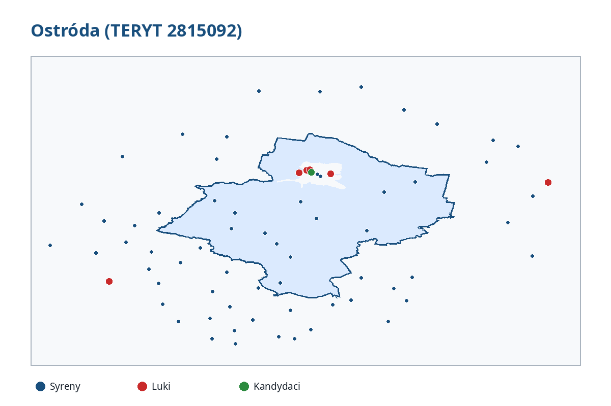

# Raport SOIA — Ostróda

**TERYT:** `2815092`  
**Poziom administracyjny:** gmina  
**Wydanie danych:** 2026.05 (inwentaryzacja: maj 2026; CAP/IoT: eksport lipiec 2026)  
**Model:** V9–V13; bufor kontekstu sąsiednich JST: 10 km.

## Podsumowanie

| Wskaźnik | Wartość |
|---|---:|
| Populacja ogółem | 16 375 |
| W zasięgu ≥65 dB(A) | 9 986 (60,98%) |
| W zasięgu ≥70 dB(A) | 5 571 |
| W zasięgu ≥75 dB(A) | 1 998 |
| Poza zasięgiem ≥65 dB(A) | 6 389 |

## RiskZone i luki

Populacja modelowa RiskZone poza zasięgiem ≥65 dB(A): **4,42**.

- luki priorytetowe: **1**;
- szacowany koszt nowych syren przypisany do luk: **0 zł**.

## Syreny, GSM i redundancja

- aktywne rekordy inwentaryzacji w jednostce: **14**;
- lokalizacje bez GSM wskazane do integracji: **1**;
- pozycje analizy redundancji: **14**.

## Rekomendacje i obiekty wrażliwe

- kandydaci/rekomendacje lokalizacyjne V13: **1**;
- obiekty wrażliwe ujęte w lokalnym pakiecie: **169**;
- łączny szacowany koszt rekomendacji i integracji GSM: **10 000 zł**.

Szczegóły dostępne są w katalogu [`tables/`](tables/) i warstwie
[`layers/soia_2815092.gpkg`](layers/soia_2815092.gpkg).

## Ograniczenia interpretacyjne

Wyniki są modelem planistycznym, a nie pomiarem terenowym. Zależą od jakości inwentaryzacji,
założeń propagacji dźwięku, rozdzielczości danych o ludności, granic administracyjnych i warstw
RiskZone. Wartości populacji mogą być ułamkowe przed zaokrągleniem. Decyzję inwestycyjną należy
poprzedzić wizją lokalną, pomiarem akustycznym oraz oceną techniczną i formalnoprawną.
