# ANALIZA KIERUNKOWA

> **Edycja internetowa.** Dane odnoszą się do inwentaryzacji z 5 maja 2026 r.
> i wyników V9-V13. Rozszerzenie CAP/IoT wyeksportowano 6 lipca 2026 r.
> Wersja danych: `2026.05`. Dokument jest modelem planistycznym, a nie
> certyfikowanym pomiarem propagacji akustycznej.
>
> **Właściciel opracowania:** Komenda Główna Państwowej Straży Pożarnej
> (KG PSP).  
> **Jednostka odpowiedzialna:** Biuro Informatyki i Łączności KG PSP
> (BIŁ KG PSP).  
> **Opracowanie:** zespół pod kierownictwem st. bryg. Michała Kłosińskiego.

[Pobierz kanoniczny PDF](source/SOIA_Analiza_Kierunkowa_v2_MSWiA_KGPSP_2_4_CAP_IOT_czytelny.pdf)
lub otwórz [manifest danych](../data/manifests/data-manifest.json).

**System Ostrzegania i Alarmowania Ludności (SOIA)**

*wersja 2 — układ odgórny*

Pokrycie ogólnokrajowe — luki — obszary ryzyka powodziowego

oraz integracja centralna przez CAP, IoT Feed, APN KG PSP i kanały odpornościowe

*Materiał dla:*

**Ministra Spraw Wewnętrznych i Administracji**

**Komendanta Głównego Państwowej Straży Pożarnej**

Data opracowania: 10 maja 2026 r.

Wersja danych źródłowych: inwentaryzacja z 5 maja 2026 r.; etap V13

**Właściciel: Komenda Główna Państwowej Straży Pożarnej (KG PSP)**

**Jednostka odpowiedzialna: Biuro Informatyki i Łączności KG PSP
(BIŁ KG PSP)**

*Opracował zespół pod kierownictwem st. bryg. Michała Kłosińskiego.*

*Warszawa, maj 2026 r.*

# Streszczenie dla decydentów

System ostrzegania ludności w Polsce dysponuje **22 614 syrenami alarmowymi**. Modelowany sygnał (≥ 65 dB(A) — próg dobrej słyszalności w warunkach miejskich) dociera do **29,35 mln osób, czyli 77,2% mieszkańców kraju**. Poza zasięgiem pozostaje 8,7 mln osób — głównie na obszarach o rozproszonej zabudowie wiejskiej.

Pokrycie województw waha się od **86,6% (śląskie) i 83,1% (łódzkie)** do **64,4% (kujawsko-pomorskie) i 67,1% (warmińsko-mazurskie)**. Nawet województwa z dobrym pokryciem mają luki w gminach o rozproszonej zabudowie. Łącznie zidentyfikowano **13 050 obszarów luk inwestycyjnych** wymagających analizy decyzyjnej.

Po nałożeniu zasięgów syren na krajowe mapy ryzyka powodziowego (ISOK / Wody Polskie) widać, że na obszarach zagrożonych powodzią mieszka **2,37 mln osób**, z czego **447 593 osoby (18,9%) pozostają poza zasięgiem skutecznego ostrzeżenia syrenowego**. To jest najbardziej krytyczna luka systemowa, którą należy zamknąć w pierwszej kolejności.

Drugim — równolegle pilnym — kierunkiem jest integracja centralna systemu sterowania. Po analizie projektu KGPSP/CAP_ALERT rekomendowane jest wdrożenie trójetapowe: ETAP I — publiczny CAP/feed alertów i podpisany, jednokierunkowy IoT Feed dla dobrowolnie podłączonych urządzeń; ETAP II — prywatny APN KG PSP i zarządzane modemy/SIM dla urządzeń priorytetowych; ETAP III — LoRa i TETRA jako dywersyfikacja dla urządzeń krytycznych. CAP opisuje alert dla ludności, natomiast wzbudzanie syren i tablic informacyjnych jest widokiem wykonawczym PL-CAP-DIST-IOT, zabezpieczonym podpisem, TERYT i świadomym opt-in operatora.

| KLUCZOWE LICZBY • 38,04 mln — ludność Polski (NSP 2021) • 22 614 — łączna liczba syren w inwentaryzacji • 77,2% — populacja w zasięgu skutecznego ostrzeżenia (≥ 65 dB(A)) • 8,7 mln — osoby poza zasięgiem (głównie obszary wiejskie) • 13 050 — zidentyfikowanych luk wymagających analizy • 2,37 mln — mieszkańcy obszarów ryzyka powodziowego • 447 593 — osoby w obszarach ryzyka POZA zasięgiem syren • 15 909 — syren bez modułu GSM (priorytet ETAPU I) • 9 grup podmiotów odpowiedzialnych — fragmentacja sterowania |
| --- |

# CZĘŚĆ I — Pokrycie ogólnokrajowe sygnałem syren

## 1.1. Obraz krajowy — 22 614 syren, 77% mieszkańców w zasięgu

Inwentaryzacja przeprowadzona na potrzeby SOIA objęła wszystkie 16 województw. Po weryfikacji i usunięciu zduplikowanych zgłoszeń uzyskano 22 032 unikalne lokalizacje syren. Spośród nich 20 921 daje mierzalny zasięg akustyczny w modelu obliczeniowym — pozostałe wymagają korekty parametrów lub weryfikacji w terenie.

Modelowany zasięg uwzględnia trzy progi słyszalności:

- 65 dB(A) — sygnał dobrze słyszalny w warunkach typowej zabudowy miejskiej; jest to próg minimalny dla skutecznego ostrzegania (29,35 mln osób, 77,2% kraju);
- 70 dB(A) — sygnał wyraźnie słyszalny, również w pomieszczeniach niezamkniętych (22,45 mln osób, 59,0% kraju);
- 75 dB(A) — sygnał słyszalny w pomieszczeniach zwartej zabudowy mieszkaniowej (14,62 mln osób, 38,4% kraju).
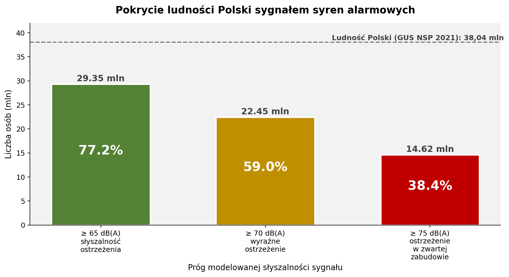

## 1.2. Mapa zasięgów akustycznych w Polsce

Poniższa mapa pokazuje przestrzenne rozmieszczenie zasięgów akustycznych syren w skali kraju. Widać wyraźnie skupiska w największych miastach (Warszawa, Łódź, Kraków, Wrocław, Katowice) oraz wzdłuż gęstszej sieci osadniczej. Obszary bez zasięgu (białe na mapie) to przede wszystkim tereny rolnicze województw warmińsko-mazurskiego, podlaskiego, lubelskiego oraz kujawsko-pomorskiego.

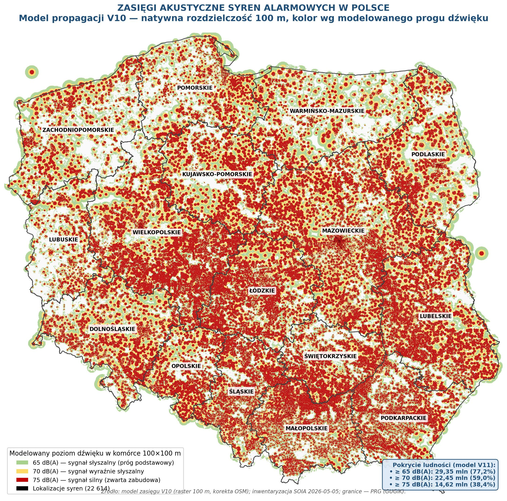

## 1.3. Pokrycie wg województw — od 86,6% do 64,4%

Pokrycie województw mierzone procentem mieszkańców w zasięgu sygnału ≥ 65 dB(A) jest wyraźnie zróżnicowane. Najlepiej wypada Śląskie (86,6%) — wynika to z bardzo gęstej zabudowy i silnej sieci syren w aglomeracji górnośląskiej. Najsłabiej — Kujawsko-Pomorskie (64,4%), gdzie liczne małe miejscowości nie są objęte zasięgiem.

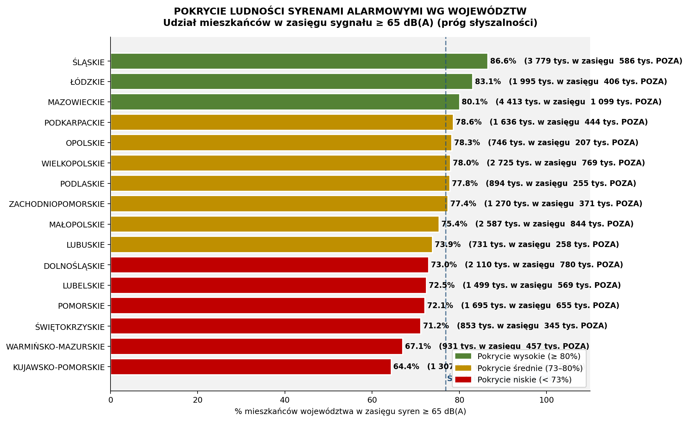

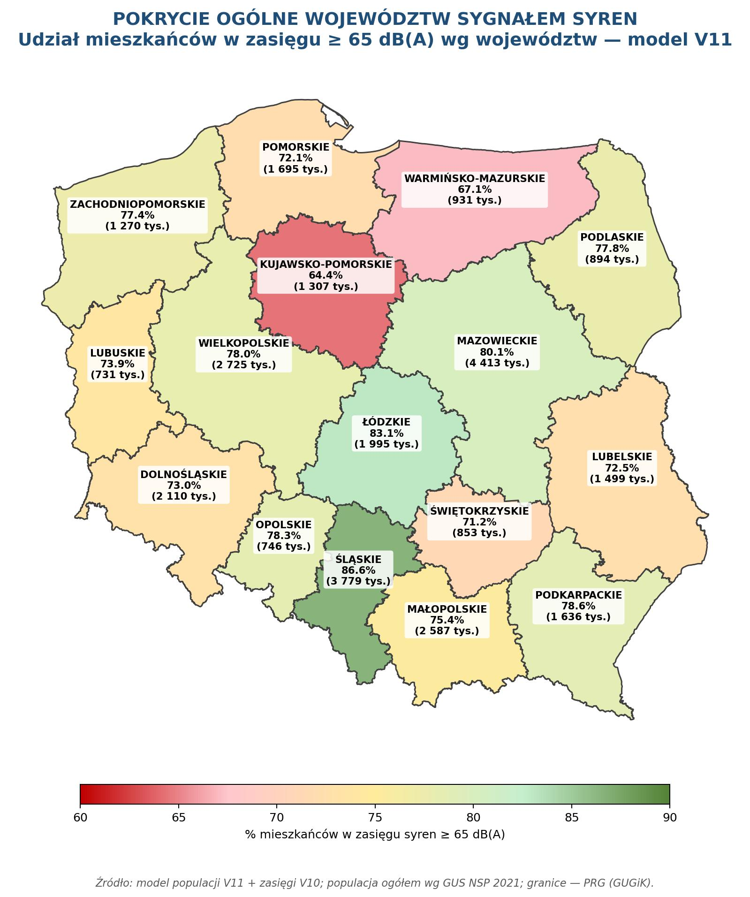

## 1.4. Pokrycie powiatów (380 jednostek)

Mapa wojewódzka maskuje silne zróżnicowanie wewnątrzregionalne. Na poziomie powiatów obraz jest dramatycznie inny: w tym samym województwie sąsiadują powiaty z pokryciem powyżej 90% (zwykle miasta na prawach powiatu) z powiatami ziemskimi, w których pokrycie spada poniżej 30%. Powiaty ziemskie wokół miast wojewódzkich (np. ziemski Zamość, Włocławek, Głogów) mają najniższe pokrycie — syreny są skoncentrowane w sąsiednim mieście, a populacja wiejska wokół pozostaje poza zasięgiem.

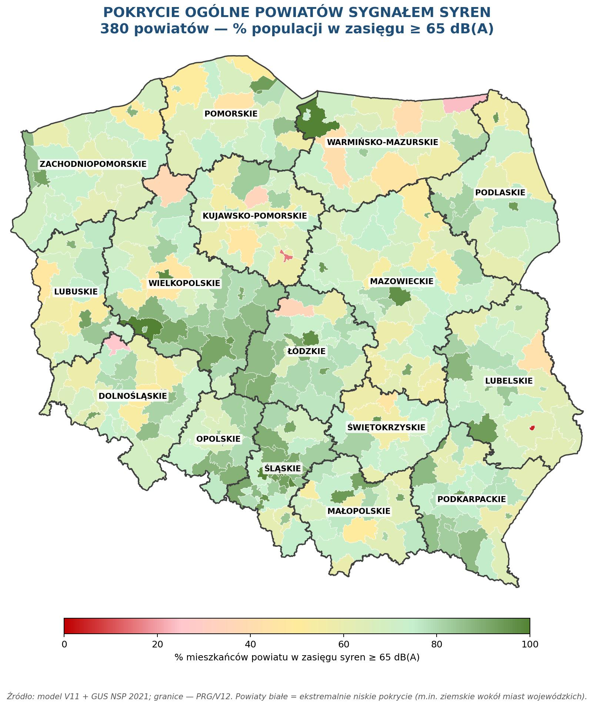

## 1.5. Pokrycie gmin — najpełniejszy obraz przestrzenny (2 477 jednostek)

Dopiero mapa gmin pokazuje rzeczywisty wzór problemu. Średnia ważona dla gmin to 66,9% (znacznie niżej niż dla województw, bo gminy wiejskie są mniejsze i częściej całkowicie poza zasięgiem). Mapa gmin to najmocniejszy pojedynczy obraz w dokumencie — pokazuje, że problem nie jest losowy, tylko ma wyraźny wzorzec: rdzenie miast = zielone, peryferie wiejskie = pomarańczowe, najbardziej rozproszone obszary wiejskie = czerwone.

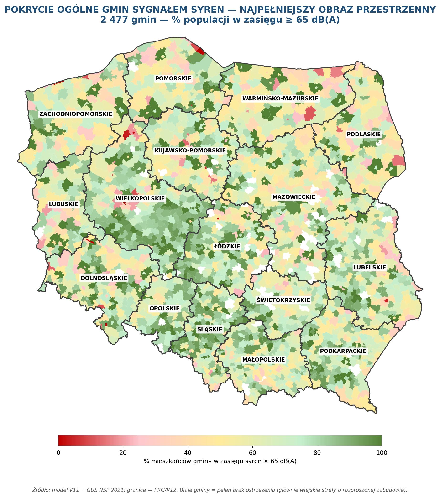

## 1.6. Treemap — proporcje populacyjne województw

Treemap kompresuje cały kraj do jednego obrazu: wielkość każdego kafelka odpowiada populacji województwa, a podział kolorystyczny pokazuje udział populacji w zasięgu (kolor) i poza zasięgiem (jasnoróżowa część kafelka). Mazowieckie i śląskie zajmują największą powierzchnię, ale to mazowieckie ma większą bezwzględną liczbę osób bez ostrzeżenia.

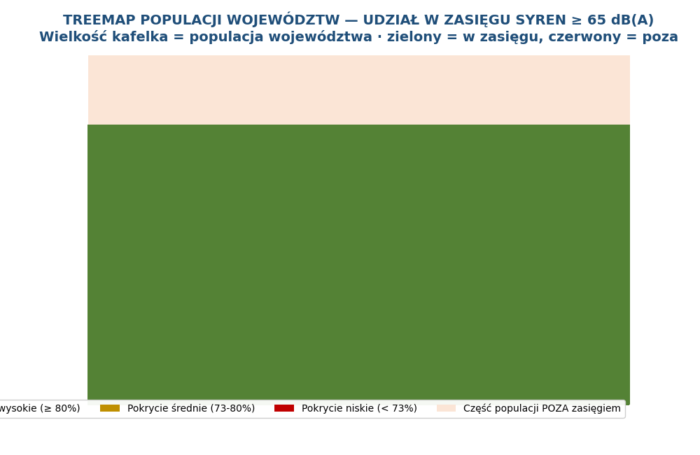

## 1.7. Tabela wojewódzka — pełne dane

*Tabela 1. Pokrycie OGÓLNE województw sygnałem syren ≥ 65 dB(A) — populacja w zasięgu i poza zasięgiem.*

| Województwo | Mieszkańców (NSP 2021) | W zasięgu ≥ 65 dB(A) | % w zasięgu | POZA zasięgiem | % poza |
| --- | --- | --- | --- | --- | --- |
| ŚLĄSKIE | 4 365 287 | 3 779 090 | 86,6% | 586 197 | 13,4% |
| ŁÓDZKIE | 2 401 993 | 1 995 460 | 83,1% | 406 533 | 16,9% |
| MAZOWIECKIE | 5 512 794 | 4 413 178 | 80,1% | 1 099 616 | 19,9% |
| PODKARPACKIE | 2 080 611 | 1 636 286 | 78,6% | 444 325 | 21,4% |
| OPOLSKIE | 954 048 | 746 789 | 78,3% | 207 259 | 21,7% |
| WIELKOPOLSKIE | 3 494 468 | 2 725 141 | 78,0% | 769 327 | 22,0% |
| PODLASKIE | 1 149 365 | 894 258 | 77,8% | 255 107 | 22,2% |
| ZACHODNIOPOMORSKIE | 1 641 189 | 1 270 004 | 77,4% | 371 185 | 22,6% |
| MAŁOPOLSKIE | 3 431 499 | 2 587 352 | 75,4% | 844 147 | 24,6% |
| LUBUSKIE | 989 981 | 731 220 | 73,9% | 258 761 | 26,1% |
| DOLNOŚLĄSKIE | 2 891 321 | 2 110 555 | 73,0% | 780 766 | 27,0% |
| LUBELSKIE | 2 068 134 | 1 499 082 | 72,5% | 569 052 | 27,5% |
| POMORSKIE | 2 350 067 | 1 695 004 | 72,1% | 655 063 | 27,9% |
| ŚWIĘTOKRZYSKIE | 1 199 094 | 853 170 | 71,2% | 345 924 | 28,8% |
| WARMIŃSKO-MAZURSKIE | 1 389 810 | 931 921 | 67,1% | 457 889 | 32,9% |
| KUJAWSKO-POMORSKIE | 2 031 471 | 1 307 795 | 64,4% | 723 676 | 35,6% |

| WNIOSEK CZĘŚCI I Pokrycie kraju jest wysokie (77,2%), ale nierównomierne — różnica między najlepszym a najsłabszym województwem to 22 punkty procentowe. Cztery województwa mają poniżej 73% pokrycia: kujawsko-pomorskie, warmińsko-mazurskie, świętokrzyskie i pomorskie. To w nich należy w pierwszej kolejności analizować potencjał inwestycyjny. Zwiększanie liczby syren wszędzie jest nieefektywne — dalsza analiza (Część II) wskaże konkretne miejsca o największym znaczeniu. |
| --- |

# CZĘŚĆ II — Luki w pokryciu

## 2.1. 13 050 zidentyfikowanych obszarów bez ostrzeżenia

Z modelu V12 wynika, że na terenie Polski znajduje się 13 050 odrębnych obszarów (luk), w których brak skutecznego zasięgu syren nakłada się na obszar wymagający ostrzegania. Każda luka jest scharakteryzowana liczbą osób bez ostrzeżenia, klasą ryzyka i rekomendowanym działaniem inwestycyjnym.

*Tabela 2. Klasyfikacja luk inwestycyjnych wg klasy priorytetu.*

| Klasa priorytetu | Liczba luk | Charakterystyka | Rekomendacja |
| --- | --- | --- | --- |
| A — pilne | 241 | Wysoka populacja, wysokie ryzyko, brak alternatyw | Działanie w pierwszej kolejności (12 mies.) |
| B — wysoki priorytet | 2 616 | Istotna populacja lub wysokie ryzyko | Działanie po potwierdzeniu lokalizacji (24 mies.) |
| C — rezerwa | 5 036 | Mniejsze populacje, średnie ryzyko | Modernizacja tańszym wariantem |
| D — niski priorytet | 5 157 | Małe populacje lub niskie ryzyko | Monitorować, nie inwestować priorytetowo |

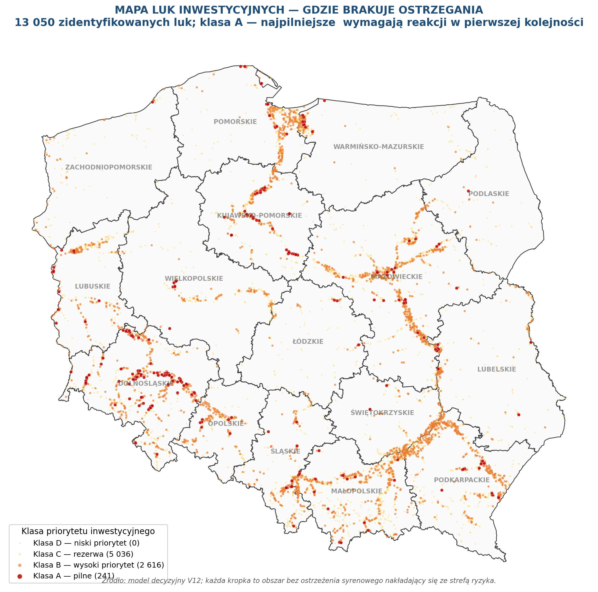

### Krzywa Pareto — koncentracja problemu

Analiza Pareto luk pokazuje silną koncentrację: **5% najpilniejszych luk pokrywa 60% całej populacji bez ostrzeżenia, a 20% luk — niemal 84%**. Ten wzorzec uzasadnia podejście warianowe: zamknięcie pierwszych 451 luk klasy A (3,5% wszystkich luk) daje większość efektu populacyjnego za ułamek kosztu wariantu docelowego.

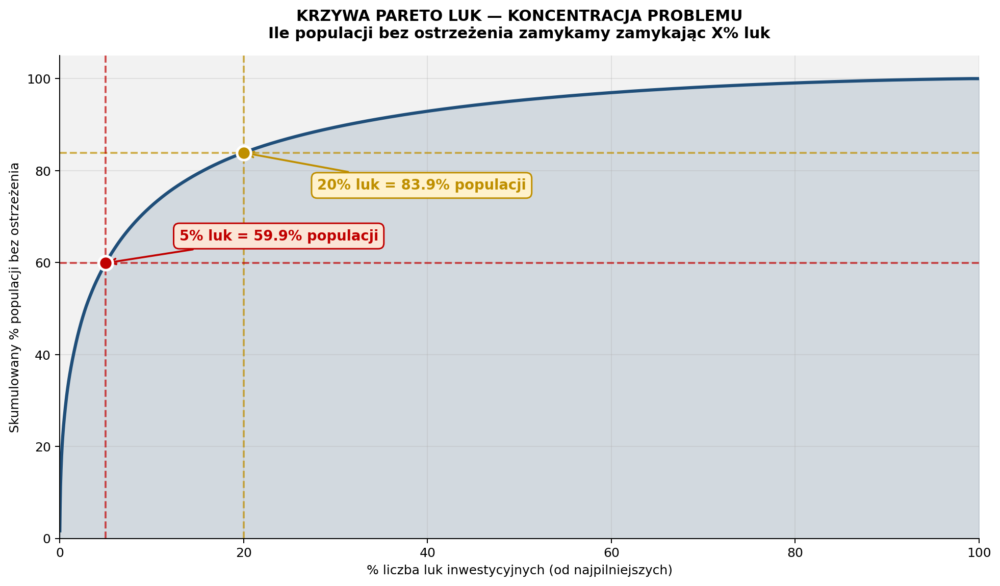

## 2.2. Hotspoty populacyjne — gdzie pojedyncza luka obejmuje najwięcej osób

Mapa hotspotów pokazuje 100 luk, w których liczba osób bez ostrzeżenia jest największa. Rozmiar kropki odzwierciedla liczbę mieszkańców. Największe pojedyncze luki znajdują się w gminach: Kęty (7 344 osób), Szczucin (5 283), Kraków (4 591), Świdnica (4 225) i Czernica (4 149).

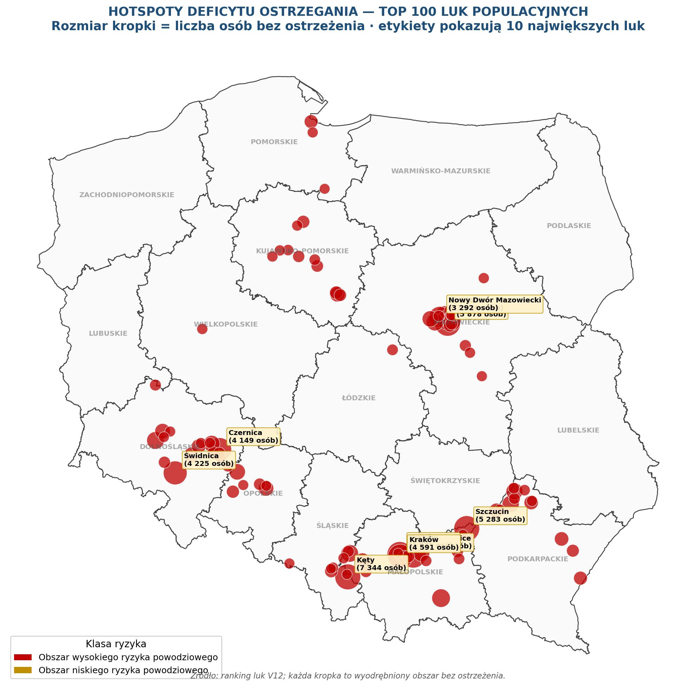

## 2.3. Województwa wymagające najszybszego działania

Liczbowo największe deficyty pokrycia (mierzone bezwzględną liczbą mieszkańców poza zasięgiem) odnotowano w województwach: mazowieckim (1,10 mln osób), małopolskim (844 tys.) i dolnośląskim (781 tys.). To liczby ogólne — w Części III pokażemy, jak ta sama metryka wygląda w obszarach ryzyka powodziowego.

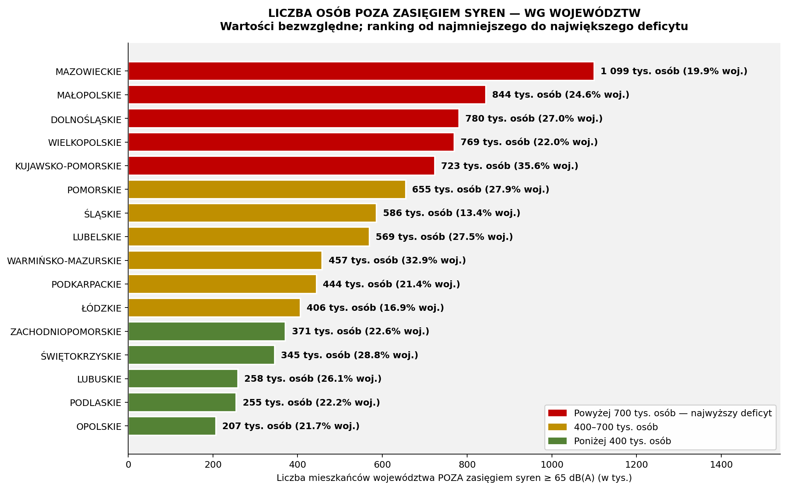

## 2.4. Profil parku syren — co dziś mamy

Zanim wskażemy luki do zamknięcia, warto zobaczyć aktualny profil parku syren w Polsce. W ujęciu krajowym inwentaryzacja V9 obejmuje 22 614 syren: 14 629 analogowych (64,7%) i 7 985 cyfrowych (35,3%). Cztery wykresy pokazują strukturę inwentaryzacji V9 w czterech wymiarach: typ (cyfrowe vs analogowe), klasę mocy, wysokość montażu nad terenem oraz status łączności GSM. Podział wojewódzki doprecyzowuje, gdzie modernizacja powinna oznaczać przede wszystkim cyfryzację i integrację sterowania, a gdzie najpierw utrzymanie dużej skali istniejącego parku.

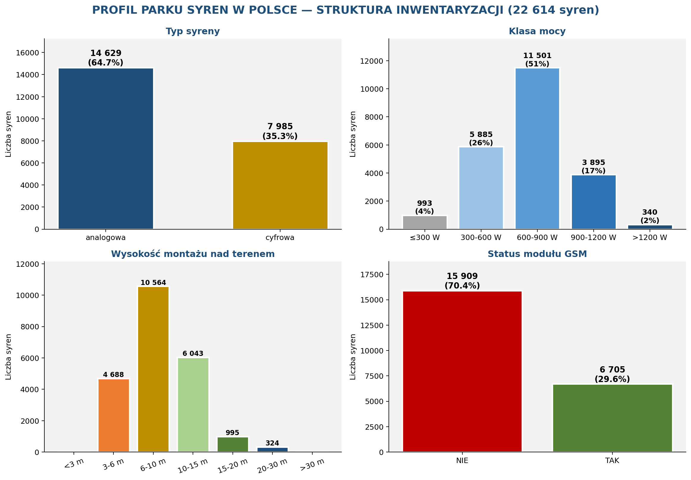

### Podział wojewódzki typów syren

Rozkład typów nie jest równomierny: w 14 z 16 województw przeważają syreny analogowe. Przewagę cyfrowych mają tylko województwa pomorskie i śląskie, natomiast największy wolumen parku pozostaje w województwach mazowieckim, wielkopolskim i lubelskim. Oznacza to, że program modernizacji powinien łączyć kryterium skali z kryterium udziału urządzeń analogowych.

*Tabela 2A. Profil parku syren według województw — liczba i udział typów.*

| Województwo | Razem | Analogowe | Cyfrowe | Profil dominujący |
| --- | --- | --- | --- | --- |
| Mazowieckie | 3 465 | 1 980 (57,1%) | 1 485 (42,9%) | analogowy |
| Wielkopolskie | 2 455 | 1 772 (72,2%) | 683 (27,8%) | analogowy |
| Lubelskie | 1 798 | 1 588 (88,3%) | 210 (11,7%) | analogowy |
| Małopolskie | 1 756 | 1 191 (67,8%) | 565 (32,2%) | analogowy |
| Śląskie | 1 717 | 774 (45,1%) | 943 (54,9%) | cyfrowy |
| Podkarpackie | 1 685 | 1 169 (69,4%) | 516 (30,6%) | analogowy |
| Łódzkie | 1 651 | 1 284 (77,8%) | 367 (22,2%) | analogowy |
| Dolnośląskie | 1 166 | 636 (54,5%) | 530 (45,5%) | analogowy |
| Kujawsko-Pomorskie | 1 139 | 906 (79,5%) | 233 (20,5%) | analogowy |
| Pomorskie | 1 076 | 366 (34,0%) | 710 (66,0%) | cyfrowy |
| Świętokrzyskie | 948 | 749 (79,0%) | 199 (21,0%) | analogowy |
| Podlaskie | 910 | 585 (64,3%) | 325 (35,7%) | analogowy |
| Zachodniopomorskie | 866 | 469 (54,2%) | 397 (45,8%) | analogowy |
| Warmińsko-Mazurskie | 727 | 437 (60,1%) | 290 (39,9%) | analogowy |
| Opolskie | 703 | 426 (60,6%) | 277 (39,4%) | analogowy |
| Lubuskie | 552 | 297 (53,8%) | 255 (46,2%) | analogowy |

Interpretacja operacyjna. Sam wskaźnik krajowy 65/35 nie wystarcza do planowania. Województwa o dużym wolumenie syren wymagają stabilnego programu utrzymania i integracji, a województwa silnie analogowe — w pierwszej kolejności doposażenia w sterowanie i łączność. Pomorskie i Śląskie mogą być traktowane jako punkt odniesienia dla docelowego profilu cyfrowego, ale nie zdejmują z programu krajowego potrzeby modernizacji regionów o największej liczbie urządzeń.

# CZĘŚĆ III — Obszary ryzyka powodziowego

## 3.1. Skala ryzyka — 2,37 mln mieszkańców

Krajowe mapy ryzyka powodziowego (opracowane przez Państwowe Gospodarstwo Wodne Wody Polskie w ramach systemu ISOK) identyfikują 1 741 142 odrębne obszary ryzyka, z czego 404 796 zaklasyfikowano jako wysokie ryzyko. Po nałożeniu siatki ludności GUS NSP 2021 uzyskano:

*Tabela 3. Mieszkańcy obszarów ryzyka powodziowego w Polsce wg klasy ryzyka.*

| Klasa ryzyka powodziowego | Mieszkańcy (osoby) | Udział kraju |
| --- | --- | --- |
| wysokie ryzyko | 1 527 797 | 4,02% |
| niskie ryzyko | 839 719 | 2,21% |
| RAZEM (obszary ryzyka) | 2 367 516 | 6,23% |

## 3.2. Pokrycie syrenami w strefach ryzyka — 81,1% / 18,9%

Z 2,37 mln mieszkańców obszarów ryzyka powodziowego sygnał syren dociera do 1,92 mln (81,1%). Pozostałe 447 593 osoby (18,9%) — co piąty mieszkaniec strefy ryzyka — pozostaje poza zasięgiem skutecznego ostrzeżenia. To jest mierzalna luka systemowa o najwyższym priorytecie zarządczym.

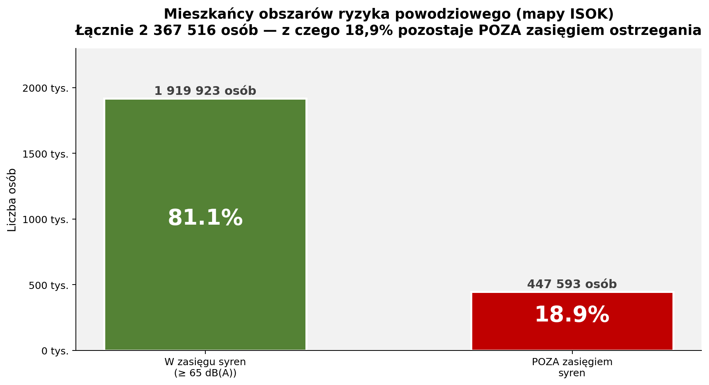

| INTERPRETACJA 447 593 osoby zamieszkujące obszary ryzyka powodziowego nie zostaną ostrzeżone sygnałem syreny. Z tej grupy 226 250 osób mieszka w obszarach wysokiego ryzyka. Awaria pojedynczego elementu systemu (wyłączenie energii, brak GSM, awaria stacji bazowej) oznacza dla nich pełną utratę kanału ostrzegania. To jest priorytet absolutny dla planu inwestycyjnego — dotyczy ludzi, którzy najbardziej potrzebują ostrzeżenia w sytuacji realnego zagrożenia. |
| --- |

## 3.3. Województwa z największym deficytem w strefach ryzyka

Liczbowo najwięcej osób bez ostrzeżenia w strefach ryzyka powodziowego mieszka w województwach: małopolskim (85 857 osób), mazowieckim (83 507) i dolnośląskim (68 307). Razem te trzy województwa odpowiadają za 53% krajowego deficytu w strefach ryzyka. Procentowo największy deficyt mają jednak: kujawsko-pomorskie (42% mieszkańców strefy ryzyka bez ostrzeżenia), warmińsko-mazurskie (40%) i podlaskie (39%).

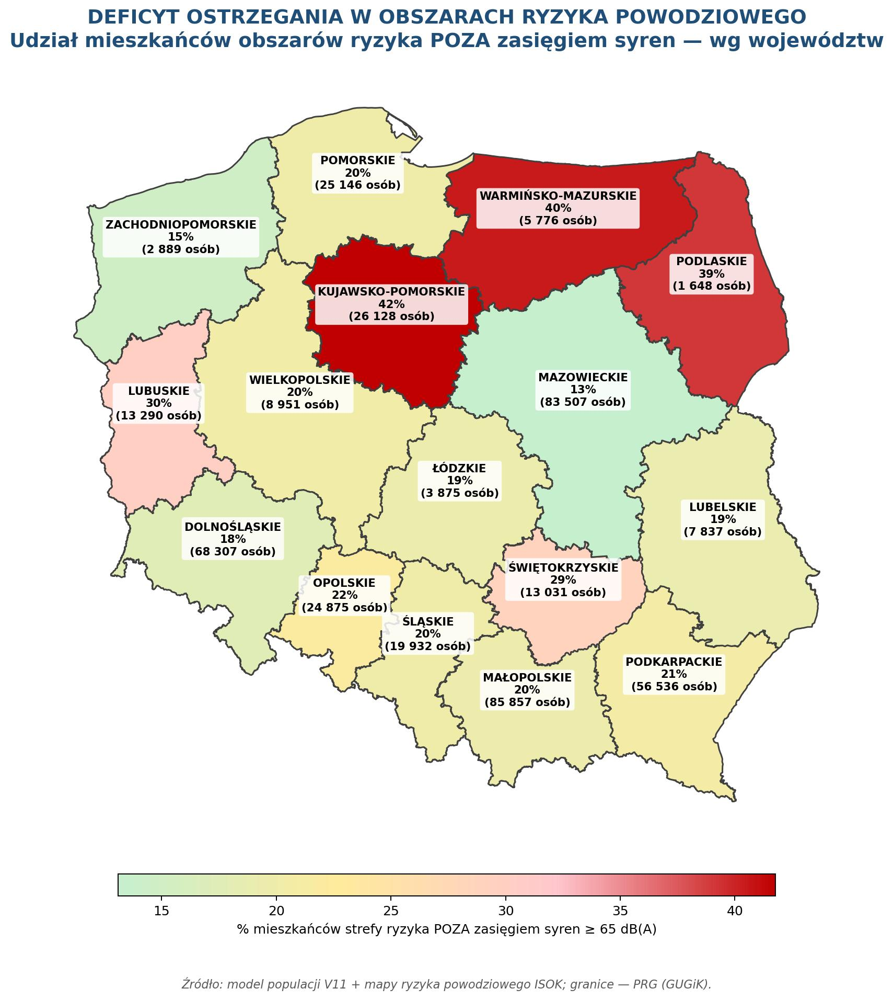

## 3.4. Mapa podwójnego ryzyka — najmocniejsza pojedyncza grafika decyzyjna

Przecięcie trzech warunków — wysokie ryzyko powodziowe + brak zasięgu syren + duża populacja — wskazuje konkretne miejsca na mapie Polski wymagające bezwzględnego priorytetu inwestycyjnego. Z 6 036 luk w obszarach wysokiego ryzyka powodziowego wyodrębniono 302 hot zones (top 5% wg populacji). To są lokalizacje, w których brak ostrzeżenia w sytuacji powodzi oznacza dla tysięcy ludzi pełną utratę kanału alarmowania.

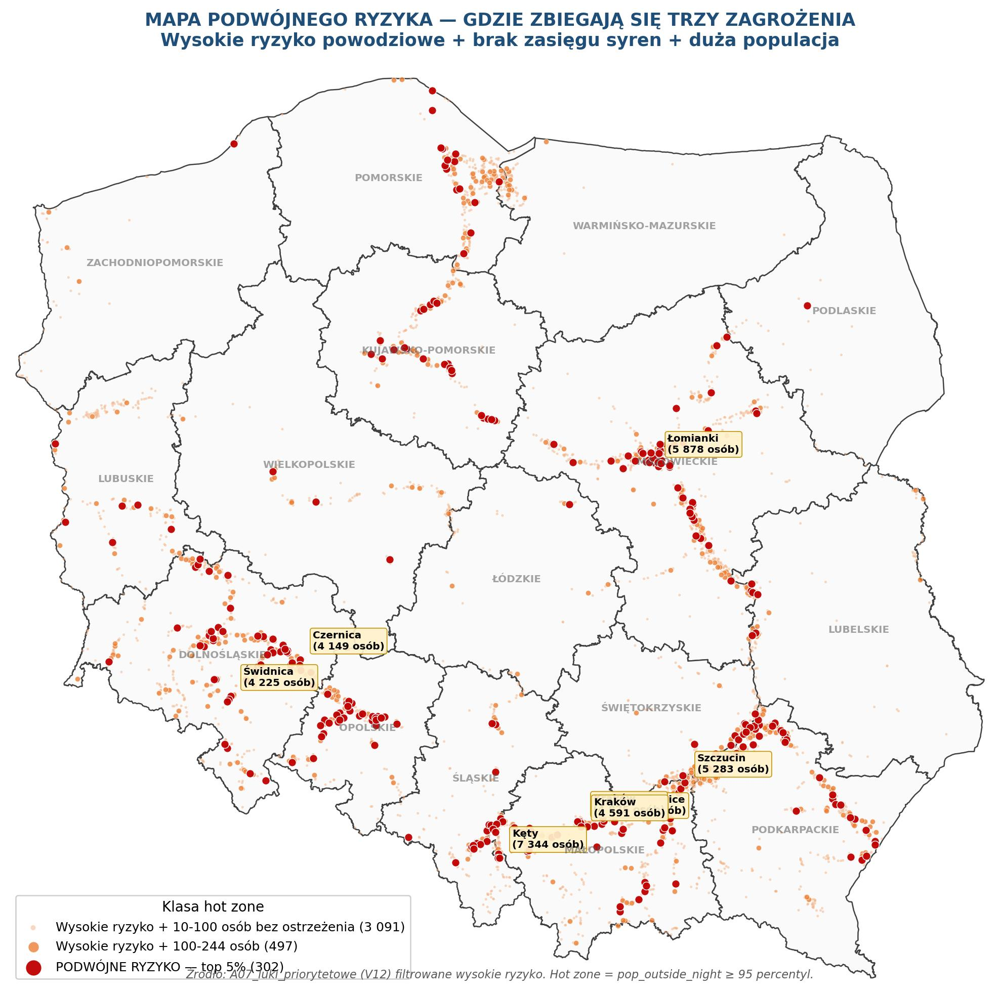

## 3.5. Cztery województwa o najwyższym priorytecie — zoom regionalny

Dla wojewodów i komendantów wojewódzkich PSP czterech regionów najbardziej deficytowych — Kujawsko-Pomorskiego, Warmińsko-Mazurskiego, Dolnośląskiego i Małopolskiego — przygotowano mapy regionalne. Każdy panel pokazuje istniejące syreny (czarne kropki), pilne luki klasy A (czerwone) i luki klasy B (pomarańczowe) na tle granic powiatowych. Dolnośląskie ma najwięcej pilnych luk klasy A (80) — to bezpośredni efekt powodzi z 2024 r.

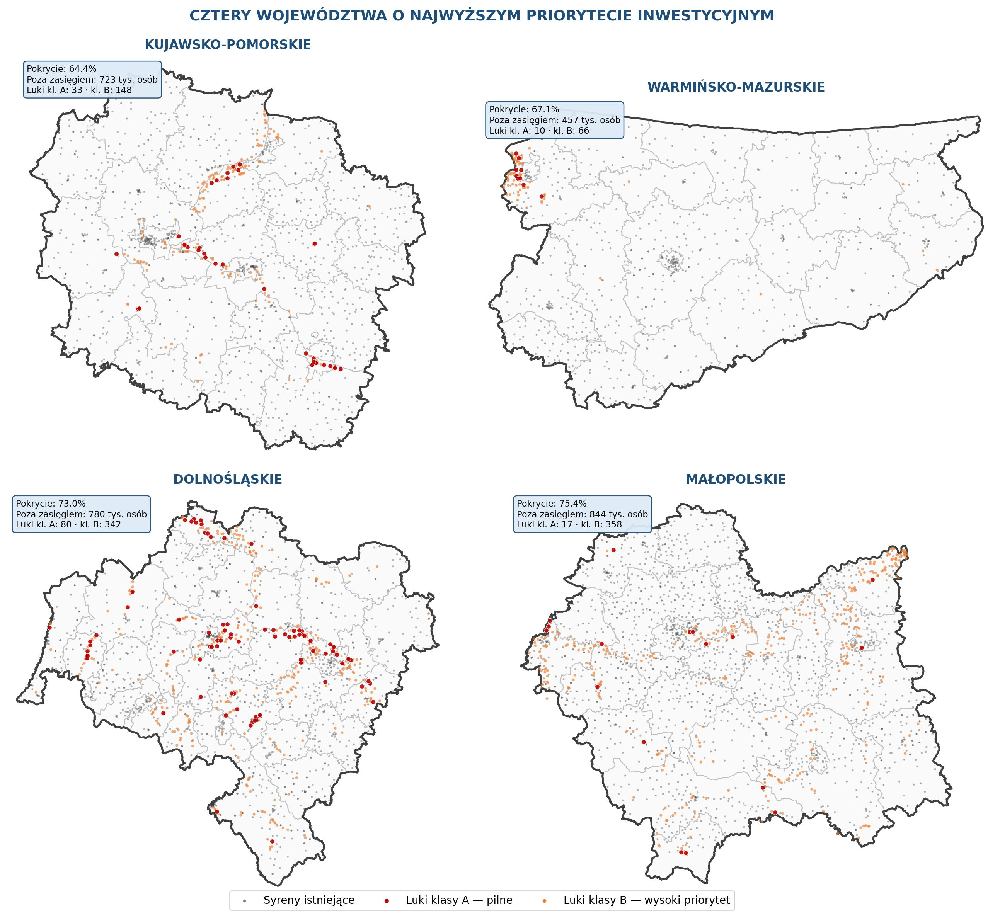

*Tabela 4. Deficyt ostrzegania w strefach ryzyka powodziowego — wszystkie województwa.*

| Województwo | W strefie ryzyka | W zasięgu ≥ 65 dB(A) | POZA zasięgiem | % poza |
| --- | --- | --- | --- | --- |
| MAŁOPOLSKIE | 436 381 | 350 523 | 85 858 | 19,7% |
| MAZOWIECKIE | 637 285 | 553 778 | 83 508 | 13,1% |
| DOLNOŚLĄSKIE | 387 544 | 319 237 | 68 308 | 17,6% |
| PODKARPACKIE | 272 099 | 215 563 | 56 536 | 20,8% |
| KUJAWSKO-POMORSKIE | 62 568 | 36 440 | 26 128 | 41,8% |
| POMORSKIE | 125 541 | 100 395 | 25 147 | 20,0% |
| OPOLSKIE | 114 288 | 89 412 | 24 875 | 21,8% |
| ŚLĄSKIE | 99 518 | 79 585 | 19 933 | 20,0% |
| LUBUSKIE | 44 238 | 30 948 | 13 291 | 30,0% |
| ŚWIĘTOKRZYSKIE | 44 915 | 31 884 | 13 031 | 29,0% |
| WIELKOPOLSKIE | 44 095 | 35 144 | 8951 | 20,3% |
| LUBELSKIE | 41 123 | 33 285 | 7838 | 19,1% |
| WARMIŃSKO-MAZURSKIE | 14 275 | 8499 | 5776 | 40,5% |
| ŁÓDZKIE | 19 973 | 16 098 | 3875 | 19,4% |
| ZACHODNIOPOMORSKIE | 19 456 | 16 566 | 2890 | 14,9% |
| PODLASKIE | 4216 | 2567 | 1649 | 39,1% |

## 3.4. Gminy z największym deficytem

Na poziomie gmin największe deficyty w obszarach wysokiego ryzyka powodziowego odnotowano w: Świdnicy (woj. dolnośląskie, 4 739 osób bez ostrzeżenia), Włocławku (4 442), Tryńczy (2 593) i Grodkowie (2 006). Pełen ranking 1 688 gmin zawiera załącznik tabelaryczny.

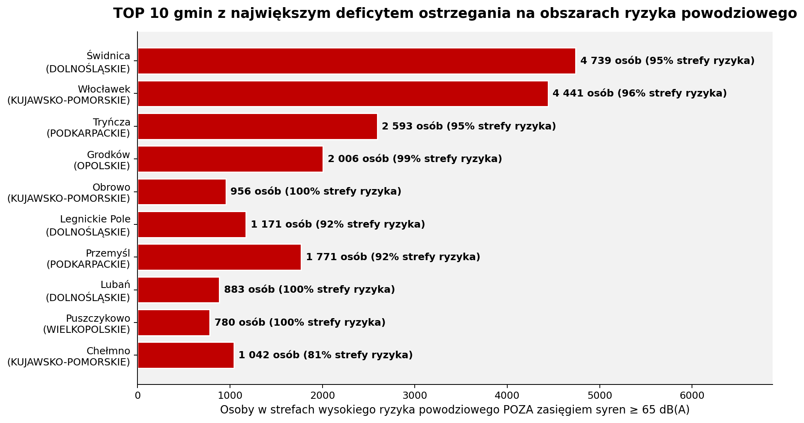

*Tabela 5. TOP 20 gmin z największym deficytem ostrzegania na obszarach ryzyka powodziowego.*

| Lp. | Gmina | Powiat | Województwo | Bez ostrzeżenia | % strefy |
| --- | --- | --- | --- | --- | --- |
| 1 | Świdnica | świdnicki | DOLNOŚLĄSKIE | 4739 | 95,2% |
| 2 | Włocławek | Włocławek | KUJAWSKO-POMORSKIE | 4442 | 95,9% |
| 3 | Tryńcza | przeworski | PODKARPACKIE | 2593 | 94,7% |
| 4 | Grodków | brzeski | OPOLSKIE | 2006 | 99,0% |
| 5 | Obrowo | toruński | KUJAWSKO-POMORSKIE | 956 | 100,0% |
| 6 | Legnickie Pole | legnicki | DOLNOŚLĄSKIE | 1172 | 92,3% |
| 7 | Przemyśl | przemyski | PODKARPACKIE | 1771 | 91,5% |
| 8 | Lubań | lubański | DOLNOŚLĄSKIE | 884 | 99,9% |
| 9 | Puszczykowo | poznański | WIELKOPOLSKIE | 781 | 100,0% |
| 10 | Chełmno | chełmiński | KUJAWSKO-POMORSKIE | 1042 | 81,1% |
| 11 | Zławieś Wielka | toruński | KUJAWSKO-POMORSKIE | 2885 | 88,7% |
| 12 | Chełmno | chełmiński | KUJAWSKO-POMORSKIE | 2985 | 84,8% |
| 13 | Elbląg | elbląski | WARMIŃSKO-MAZURSKIE | 2903 | 86,7% |
| 14 | Miękinia | średzki | DOLNOŚLĄSKIE | 2681 | 82,1% |
| 15 | Wisznia Mała | trzebnicki | DOLNOŚLĄSKIE | 571 | 99,9% |
| 16 | Krzeszyce | sulęciński | LUBUSKIE | 988 | 93,0% |
| 17 | Alwernia | chrzanowski | MAŁOPOLSKIE | 585 | 97,5% |
| 18 | Włocławek | włocławski | KUJAWSKO-POMORSKIE | 645 | 99,1% |
| 19 | Tarnów Opolski | opolski | OPOLSKIE | 569 | 91,7% |
| 20 | Gniewoszów | kozienicki | MAZOWIECKIE | 1239 | 80,5% |

# CZĘŚĆ IV — Obszary do doposażenia w syreny

Każda zidentyfikowana luka jest oceniana w 4-stopniowym łańcuchu decyzyjnym: integracja istniejącej syreny → modernizacja istniejącej syreny → nowa syrena → walidacja terenowa przed zakupem. Nie każdy brak ostrzeżenia wymaga zakupu — w wielu lokalizacjach problem leży w łączności lub sterowaniu, a nie w fizycznym braku urządzenia.

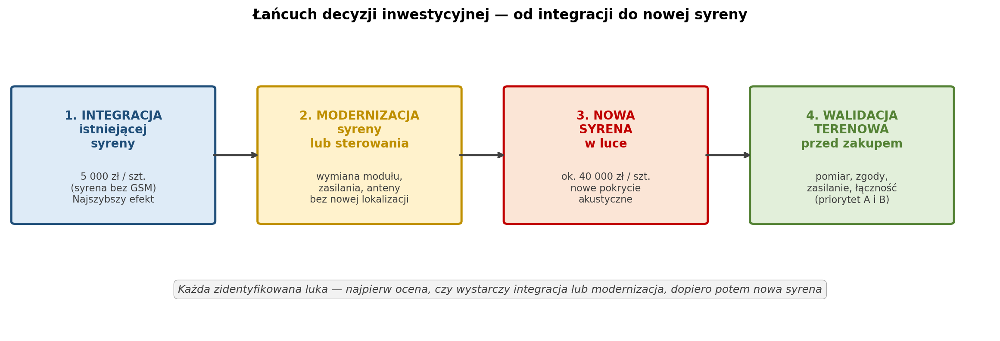

## 4.0. Wizualizacja efektu wariantu PODSTAWOWEGO — porównanie PRZED i PO

Najprostszy sposób uzasadnienia inwestycji to pokazanie wizualnego efektu. Mapa porównawcza pokazuje stan obecny (lewy panel — wszystkie 13 050 luk z 241 pilnymi czerwonymi) oraz stan po wdrożeniu wariantu PODSTAWOWEGO (prawy panel — 451 luk klasy A zamkniętych zielonymi krzyżykami, klasa B i niższe pozostają do dalszych etapów). Inwestycja 97 mln zł zamyka pełen priorytet A — czyli obejmuje populację z 60% wszystkich luk (zgodnie z krzywą Pareto).

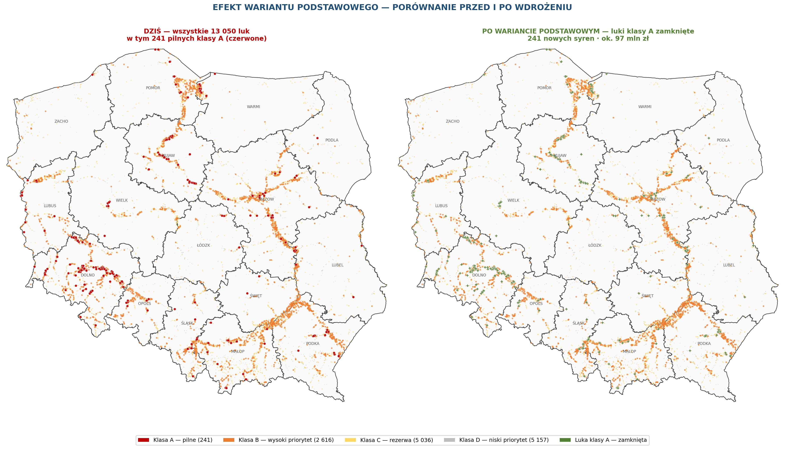

## 4.1. Ranking nowych lokalizacji w strefach ryzyka

Z modelu V13 wynika 2 501 kandydackich lokalizacji nowych syren, z czego 451 zakwalifikowano w kategorii nowa duża syrena w priorytecie A (najpilniejsze inwestycje). Dla każdej lokalizacji obliczono dodatkową populację objętą sygnałem ≥ 65 dB(A), klasę ryzyka i rekomendowaną klasę mocy.

*Tabela 6. TOP 12 priorytetowych lokalizacji nowych syren w strefach ryzyka powodziowego (priorytet A).*

| Lp. | Gmina | Województwo | Klasa ryzyka | Moc rek. | Nowa pop. ≥65 dB | Koszt szac. |
| --- | --- | --- | --- | --- | --- | --- |
| 1 | Włocławek | KUJAWSKO-POMORSKIE | wysokie ryzyko | 1200 W | 1 526 | 40 000 zł |
| 2 | Mosina | WIELKOPOLSKIE | wysokie ryzyko | 600 W | 129 | 40 000 zł |
| 3 | Włocławek | KUJAWSKO-POMORSKIE | wysokie ryzyko | 600 W | 105 | 40 000 zł |
| 4 | Świebodzice | DOLNOŚLĄSKIE | wysokie ryzyko | 600 W | 115 | 40 000 zł |
| 5 | Karczew | MAZOWIECKIE | wysokie ryzyko | 900 W | 507 | 40 000 zł |
| 6 | Świdnica | DOLNOŚLĄSKIE | wysokie ryzyko | 1200 W | 4 226 | 40 000 zł |
| 7 | Legnickie Pole | DOLNOŚLĄSKIE | wysokie ryzyko | 600 W | 102 | 40 000 zł |
| 8 | Świdnica | DOLNOŚLĄSKIE | wysokie ryzyko | 900 W | 312 | 40 000 zł |
| 9 | Włocławek | KUJAWSKO-POMORSKIE | wysokie ryzyko | 900 W | 912 | 40 000 zł |
| 10 | Włocławek | KUJAWSKO-POMORSKIE | wysokie ryzyko | 1200 W | 1 079 | 40 000 zł |
| 11 | Wisznia Mała | DOLNOŚLĄSKIE | wysokie ryzyko | 900 W | 447 | 40 000 zł |
| 12 | Świdnica | DOLNOŚLĄSKIE | wysokie ryzyko | 300 W | 78 | wal. terenowa |

## 4.2. Modernizacja istniejących syren

Dla wielu lokalizacji wystarczająca jest modernizacja istniejącej infrastruktury — wymiana modułu komunikacyjnego, instalacja anten, dodanie podtrzymania bateryjnego. Koszt jest istotnie niższy od nowej syreny (5–10 tys. zł za lokalizację vs 40 tys. zł za nowe urządzenie). W wielu obszarach syrena fizycznie istnieje, ale nie ma niezawodnej łączności lub potwierdzeń.

Modernizacja powinna w pierwszej kolejności objąć:

- syreny w 15 największych miastach wojewódzkich, które są krytyczne pod względem populacji (lista syren krytycznych w Tabeli 7);
- syreny w obszarach wysokiego ryzyka powodziowego, gdzie istniejące urządzenie ma sprawne ramię akustyczne, ale brak monitorowanej łączności;
- syreny w lokalizacjach z dobrym pokryciem terenu, ale starym sterowaniem analogowym — tu wymiana modułu kosztuje znacznie mniej niż nowa instalacja.
### Syreny krytyczne — najwyższe ryzyko utraty pokrycia

*Tabela 7. TOP 15 syren krytycznych — najwyższe ryzyko utraty pokrycia po awarii pojedynczego urządzenia.*

| Lp. | Województwo | Miasto | Właściciel | Rodzaj | Moc | GSM | Pop. zagrożona |
| --- | --- | --- | --- | --- | --- | --- | --- |
| 1 | ŁÓDZKIE | Łódź | Prezydent Miasta | cyfrowa | 1200 W | NIE | 32 343 |
| 2 | DOLNOŚLĄSKIE | Wrocław | Prezydent Miasta | cyfrowa | 1500 W | NIE | 29 832 |
| 3 | DOLNOŚLĄSKIE | Wrocław | Prezydent Miasta | cyfrowa | 1500 W | NIE | 28 620 |
| 4 | ŁÓDZKIE | Łódź | Prezydent Miasta | cyfrowa | 1200 W | NIE | 28 125 |
| 5 | LUBELSKIE | Lublin | Wojewoda | analogowa | 900 W | NIE | 26 743 |
| 6 | WIELKOPOLSKIE | Września | Burmistrz | analogowa | 1200 W | NIE | 26 344 |
| 7 | ŁÓDZKIE | Łódź | Prezydent Miasta | cyfrowa | 1200 W | NIE | 26 300 |
| 8 | KUJAWSKO-POMORSKIE | Bydgoszcz | Wojewoda | cyfrowa | 2000 W | TAK | 26 100 |
| 9 | MAŁOPOLSKIE | Kraków | Wojewoda | analogowa | 1200 W | NIE | 25 501 |
| 10 | DOLNOŚLĄSKIE | Wrocław | Prezydent Miasta | cyfrowa | 1500 W | NIE | 24 892 |
| 11 | ŁÓDZKIE | Łódź | Prezydent Miasta | cyfrowa | 1200 W | NIE | 24 808 |
| 12 | DOLNOŚLĄSKIE | Wrocław | Prezydent Miasta | cyfrowa | 1500 W | NIE | 24 647 |
| 13 | DOLNOŚLĄSKIE | Wrocław | Prezydent Miasta | cyfrowa | 1500 W | NIE | 24 589 |
| 14 | ŁÓDZKIE | Łódź | Prezydent Miasta | cyfrowa | 1200 W | NIE | 23 750 |
| 15 | DOLNOŚLĄSKIE | Wrocław | Prezydent Miasta | cyfrowa | 1500 W | NIE | 23 734 |

## 4.3. Obiekty wrażliwe w obszarach luk klasy A

Z bazy OSM wyodrębniono **85 317 obiektów wrażliwych** — szkoły, przedszkola, szpitale, DPS, urzędy, dworce. W buforze 1 km od pilnych luk klasy A znajduje się **1 106 takich obiektów**. To są miejsca, w których brak ostrzeżenia syrenowego ma podwyższoną wagę społeczną — bo dotyczy zorganizowanych grup ludności (uczniów, pacjentów, pensjonariuszy, podróżnych).

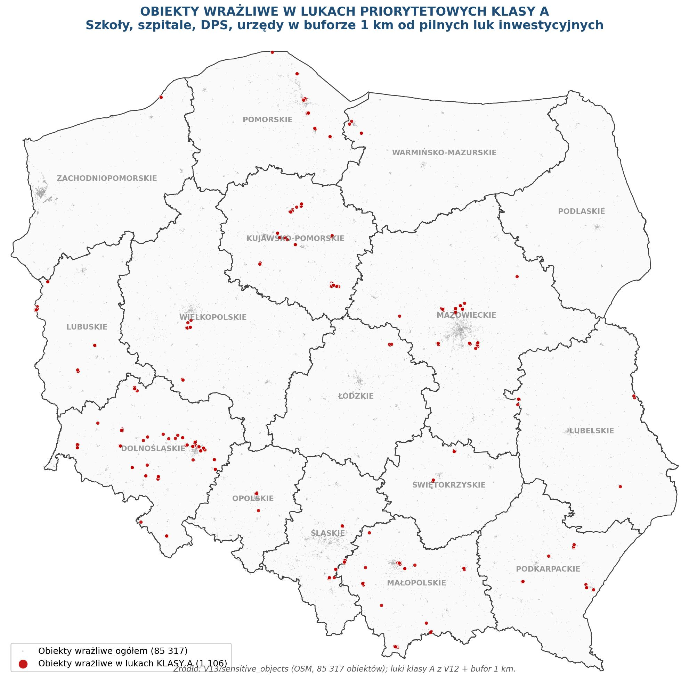

*Tabela 8. TOP 14 gmin wg liczby obiektów wrażliwych znajdujących się w buforze 1 km od luk klasy A.*

| Lp. | Gmina | Liczba obiektów wrażliwych w lukach |
| --- | --- | --- |
| 1 | Gdańsk | 199 |
| 2 | Włocławek | 190 |
| 3 | Wrocław | 96 |
| 4 | Nowy Dwór Mazowiecki | 61 |
| 5 | Kraków | 54 |
| 6 | Legionowo | 37 |
| 7 | Słubice | 36 |
| 8 | Chojnów | 33 |
| 9 | Zakopane | 31 |
| 10 | Głogów | 23 |
| 11 | Chełmno | 21 |
| 12 | Konstancin-Jeziorna | 17 |
| 13 | Nieporęt | 16 |
| 14 | Zławieś Wielka | 14 |
| 15 | pozostałe gminy | 278 |

## 4.4. Walidacja terenowa

Przed ostatecznym zakupem lub montażem nowej syreny dla lokalizacji w priorytecie A i B konieczna jest walidacja terenowa:

- sprawdzenie możliwości montażu na obiekcie (zgody właścicielskie, parametry konstrukcji);
- potwierdzenie zasilania i miejsca na podtrzymanie bateryjne;
- test łączności GSM/APN oraz dostępność kanału zapasowego;
- pomiar tła akustycznego i identyfikacja przeszkód terenowych;
- odsłuch próbny dla reprezentatywnych punktów w obszarze oddziaływania.
Walidacja terenowa jest planowana dla 2 501 kandydackich lokalizacji — pełna lista w pliku candidate_site_validation_V13.csv.

# CZĘŚĆ V — Publiczny CAP, IoT Feed i kanały odpornościowe

Analiza projektu KGPSP/CAP_ALERT zmienia punkt ciężkości integracji centralnej. Rdzeniem nie powinien być od razu zamknięty system sterowania wszystkimi syrenami, lecz wspólny standard alertu i kontrolowany, podpisany widok wykonawczy dla urządzeń. PL-CAP, oparty o CAP 1.2, zapewnia jednolitą treść ostrzeżenia, a PL-CAP-DIST-IOT umożliwia sterownikom syren i tablic informacyjnych pobieranie komend wykonawczych bez mieszania semantyki alertu z routingiem kanałów.

| Zasada architektoniczna: CAP/PL-CAP opisuje alert dla ludności; PL-CAP-DIST wybiera kanały dystrybucji; IoT Feed jest tylko podpisanym, jednokierunkowym widokiem wykonawczym. Publikacja komendy w feedzie albo pobranie feedu przez sterownik nie jest dowodem fizycznego uruchomienia syreny. |
| --- |

## 5.1. CAP/PL-CAP — publiczna warstwa alertów

Projekt CAP_ALERT stanowi punkt wejścia do profilu PL-CAP: publicznego, maszynowo-czytelnego formatu ostrzegania ludności, opartego o OASIS CAP 1.2. Repozytorium obejmuje profil PL-CAP, serwer demonstracyjny Next.js/PostgreSQL/Drizzle, publiczne API JSON i CAP XML, publiczny feed, kokpit operatora, walidację, audyt oraz IoT Feed MVP. Dla SOIA oznacza to, że kanały telefoniczne, aplikacyjne, WWW, medialne, tablice informacyjne i syreny mogą korzystać ze wspólnego opisu alertu.

- Publiczne API dla ludności i aplikacji powinno udostępniać aktywne alerty, szczegóły alertu, CAP XML oraz publiczny feed.
- Routing kanałów, retry, potwierdzenia, statusy dostarczenia i parametry wykonawcze nie powinny być dopisywane do publicznego CAP; należą do PL-CAP-DIST.
- Dane obszaru muszą być spójne z TERYT/PRG, aby alert i komenda wykonawcza wskazywały właściwe województwo, powiat, gminę lub miejscowość.
## 5.2. ETAP I — publiczny feed i IoT Feed MVP

Pierwszym etapem jest uruchomienie publicznej warstwy alertów oraz podpisanego, odczytowego IoT Feed dla urządzeń, które dobrowolnie połączą się z serwerem CAP/PL-CAP. W tej fazie telefon, aplikacja, serwis WWW lub system zewnętrzny pobiera publiczny alert, natomiast sterownik syreny albo tablicy informacyjnej pobiera osobny feed wykonawczy. Sterownik wykonuje tylko komendy zgodne z jego klasą urządzenia, profilem, wersją słowników i przypisaniem TERYT.

*Tabela 9. Trzy etapy aktualizacji centralnej warstwy wzbudzania alertów.*

| Etap | Zakres | Mechanizm | Warunek / ograniczenie |
| --- | --- | --- | --- |
| I | Publiczny CAP/feed i dobrowolny IoT Feed MVP dla syren, tablic oraz innych urządzeń wykonawczych. | Publiczne alerty dla ludzi; /api/v1/iot/feed, /profile, /dictionaries i public-key dla sterowników. | Brak ACK/telemetrii; opt-in operatora; podpis Ed25519; zgodność TERYT i wersji profilu. |
| II | Przejście urządzeń priorytetowych do zarządzanego kanału KG PSP. | SIM w APN operatora KG PSP, prywatna transmisja GSM/DMR, centralna polityka konfiguracji. | Wymaga rejestru urządzeń, procedury wydawania SIM i osobnej decyzji dla kanału zwrotnego. |
| III | Dywersyfikacja dla urządzeń krytycznych i obszarów wysokiego ryzyka. | LoRa i TETRA jako kanały zapasowe lub alternatywne wobec IP/GSM. | Stosować selektywnie: centra miast, obszary powodziowe, infrastruktura krytyczna i miejsca bez odpornej łączności. |

## 5.3. Kontrakt IoT Feed — bezpieczeństwo i TERYT

IoT Feed w CAP_ALERT jest osobnym kontraktem technicznym dla sterowników. Minimalny zestaw endpointów obejmuje GET /api/v1/iot/feed, GET /api/v1/iot/profile, GET /api/v1/iot/dictionaries, GET /api/v1/iot/public-key oraz GET /api/v1/iot/public-key.pem. Koperta feedu zawiera m.in. activeCommands, eventWindow, sequence, feedExpiresAt i signature. Sterownik musi zweryfikować podpis Ed25519, kid, środowisko, profileVersion, dictionaryVersion, świeżość feedExpiresAt, monotoniczność sequence oraz unikalność iotCommandId.

- Syrena nie uruchamia się automatycznie od każdego alertu P1; wymagany jest świadomy wybór operatora, tj. sirenRequested.
- Sygnały MVP dla SIREN_CONTROLLER to SIREN_ALARM_MODULATED_3M oraz SIREN_CANCEL_PENDING.
- Adresowanie do gminy powinno używać PL-TERYT:TERC-GMI; urządzenie uruchamia się tylko wtedy, gdy jego przypisany obszar pasuje do geokodów komendy.
- MVP nie definiuje endpointów POST dla ACK, telemetrii, statusu urządzenia ani dowodu wykonania alarmowania.
*Tabela 10. Ryzyka i bramki kontrolne dla publicznego CAP/IoT Feed.*

| Ryzyko | Znaczenie dla SOIA | Minimalna bramka kontrolna |
| --- | --- | --- |
| Brak dowodu wykonania | HTTP 200, pobranie feedu albo obecność komendy nie potwierdzają fizycznego uruchomienia syreny. | W UI i raportach nie używać statusu „wykonano” bez osobnego kanału potwierdzeń; ACK/telemetria tylko po nowym ADR/OpenAPI. |
| Różna jakość sterowników | Część urządzeń może nie obsługiwać podpisów, cache, sekwencji, okien czasu albo słowników. | Certyfikacja zgodności producenta: podpis, ETag/304/429, feedExpiresAt, sequence, iotCommandId, profile/dictionary version. |
| Zależność od internetu i operatorów | Publiczny feed i komercyjny GSM mogą być niedostępne podczas awarii lub przeciążenia. | Etap II przez APN KG PSP oraz Etap III przez LoRa/TETRA dla urządzeń priorytetowych. |
| Błędne mapowanie TERYT | Niewłaściwa gmina lub miejscowość może spowodować brak alarmu albo alarm poza obszarem zdarzenia. | Rejestr przypisań TERYT sterownika, walidacja TERC-GMI/SIMC i testy scenariuszy powiat/gmina/miejscowość. |
| Rotacja kluczy i wersji | Zmiana kid, profilu lub słownika może zablokować urządzenia bez aktualnej konfiguracji zaufania. | Procedura rotacji z kluczem current/previous, lista akceptowanych wersji i testy rollback. |

## 5.4. ETAP II — prywatny APN KG PSP

Drugi etap obejmuje urządzenia priorytetowe, które powinny działać w zarządzanej domenie KG PSP. W praktyce oznacza to przekazanie kart SIM do APN operatora KG PSP, uporządkowanie identyfikatorów urządzeń, centralną politykę konfiguracji i kontrolowany kanał transmisji GSM/DMR. CAP/PL-CAP nadal pozostaje źródłem semantyki alertu, natomiast APN wzmacnia warstwę transportową, nadzór i bezpieczeństwo urządzeń włączonych do programu.

- Zakres Etapu II powinien zaczynać się od gmin i obiektów o najwyższym ryzyku oraz największej liczbie osób poza zasięgiem ostrzegania.
- Rejestr urządzeń musi wiązać numer SIM, identyfikator sterownika, klasę urządzenia, TERYT, właściciela i status certyfikacji.
- Kanał zwrotny, jeśli będzie wymagany, powinien zostać opisany jako osobny kontrakt, a nie dopisany ad hoc do publicznego IoT Feed.
## 5.5. ETAP III — LoRa/TETRA dla urządzeń krytycznych

Trzeci etap nie powinien obejmować wszystkich syren w kraju jedną technologią. Jego celem jest odporność wybranych urządzeń: tam, gdzie awaria GSM/IP miałaby największe skutki, należy dodać modemy LoRa oraz TETRA jako kanały zapasowe lub alternatywne. LoRa może obsługiwać proste, lokalne komendy o małej przepływności, a TETRA powinna zostać użyta dla węzłów bezpieczeństwa publicznego, centrów miast, obszarów powodziowych i infrastruktury krytycznej.

- Dobór urządzeń do LoRa/TETRA powinien wynikać z rankingu ryzyka: populacja poza zasięgiem, ryzyko powodziowe, rola obiektu i awaryjność łączności.
- Kanał zapasowy nie zastępuje CAP/PL-CAP; przenosi jedynie uzgodnioną decyzję wykonawczą do sterownika.
- Każdy kanał redundantny musi przejść test zgodności: poprawny obszar TERYT, brak powtórzeń komendy, obsługa cancel i zachowanie po utracie czasu/klucza.
## 5.6. Rekomendacje decyzyjne

- Utrzymać IoT Feed jako jednokierunkowy MVP do czasu formalnej decyzji o ACK, telemetrii i statusie urządzeń.
- Nie komunikować w systemach publicznych „syrena uruchomiona” na podstawie samego feedu; można potwierdzać tylko publikację i ważność komendy.
- Zatwierdzić test zgodności producentów sterowników: Ed25519, kid, ETag, sequence, feedExpiresAt, profileVersion, dictionaryVersion i TERYT.
- Rozpocząć Etap II od urządzeń priorytetowych wskazanych przez analizę luk i ryzyka, a nie od równomiernego zakupu dla wszystkich gmin.
- LoRa/TETRA wdrażać selektywnie, jako element odporności narodowej i regionalnej, po wyborze urządzeń krytycznych dla bezpieczeństwa ludności.
# CZĘŚĆ VI — Warianty budżetowe i decyzje

Na podstawie inwentaryzacji V9, ocenionych luk V12 i kosztów jednostkowych zbudowano cztery realistyczne warianty inwestycyjne dla działań terenowych. Do każdego wariantu należy doliczyć osobno koszt warstwy integracyjnej: publiczny CAP/IoT Feed, APN KG PSP dla urządzeń priorytetowych oraz kanały LoRa/TETRA dla urządzeń krytycznych.

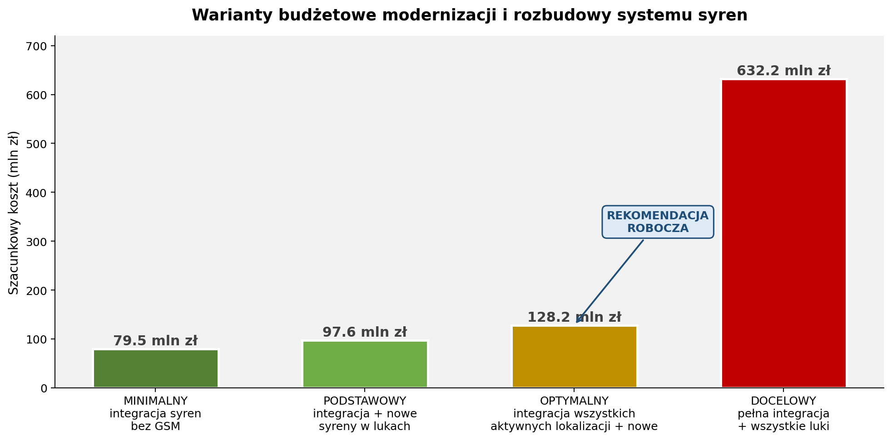

### Warianty na płaszczyźnie koszt × liczba nowych syren

Bubble chart pokazuje warianty na dwóch wymiarach jednocześnie — kosztu i liczby nowych syren do zakupu. Wariant DOCELOWY (632 mln zł, 13 050 nowych syren) jest niewspółmierny do efektu populacyjnego — zgodnie z krzywą Pareto większość populacji bez ostrzeżenia jest pokryta już przez wariant podstawowy lub optymalny.

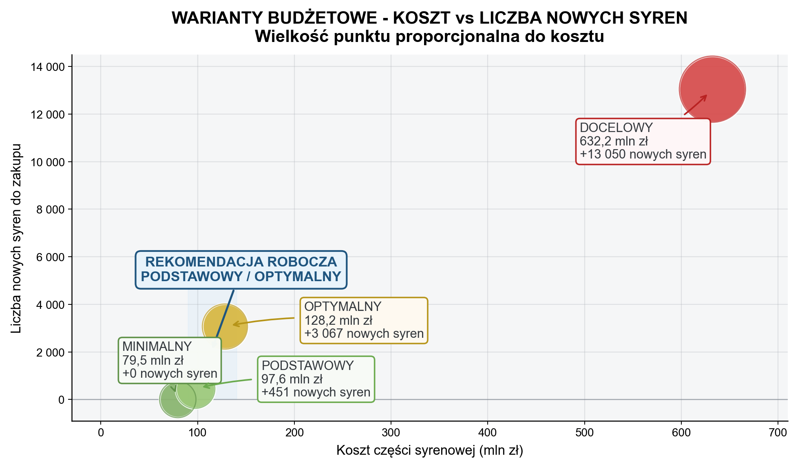

*Tabela 11. Warianty budżetowe — koszt syren plus wydzielona warstwa integracji CAP/IoT/APN.*

| Wariant | Zakres | Liczba pozycji | Koszt syren (mln zł) | + warstwa integracyjna | RAZEM |
| --- | --- | --- | --- | --- | --- |
| Minimalny | CAP/IoT Feed + integracja syren bez GSM | 15 909 syren | 79,5 | ok. 50–100 | 129,5–179,5 |
| Podstawowy | CAP/IoT Feed + APN priorytetowy + nowe syreny w lukach A | 16 360 pozycji | 97,6 | ok. 50–100 | 147,6–197,6 |
| Optymalny | CAP/IoT Feed + APN szerszy + nowe syreny w lukach A i B | 22 483 pozycje | 128,2 | ok. 80–120 | 208,2–248,2 |
| Docelowy | Pełny CAP/IoT/APN + LoRa/TETRA + wszystkie 13 050 luk | 35 082 pozycje | 632,2 | ok. 100–150 | 732,2–782,2 |

| REKOMENDACJA ROBOCZA Wariant PODSTAWOWY lub OPTYMALNY z etapowaniem CAP/IoT Feed, APN KG PSP i LoRa/TETRA dla urządzeń krytycznych. Budżet roboczy: 148–248 mln zł / 24 mies.; zakres zamyka najpilniejsze luki i prowadzi od publicznego feedu do zarządzanej, odpornej warstwy wzbudzania. |
| --- |

## Decyzje wymagające zatwierdzenia kierunkowego

- Wybór wariantu budżetowego (rekomendacja: PODSTAWOWY lub OPTYMALNY).
- Zatwierdzenie trójetapowego harmonogramu integracji centralnej: CAP/IoT Feed, APN KG PSP, LoRa/TETRA, wraz z zasadą jednokierunkowego IoT Feed MVP i certyfikacją sterowników względem profilu PL-CAP-DIST-IOT.
- Wskazanie zespołu międzyresortowego odpowiedzialnego za wdrożenie warstwy sterowania (z udziałem MSWiA, KG PSP, RCB, Wód Polskich, samorządów wojewódzkich).
- Akceptacja zlecenia walidacji terenowej dla 12 priorytetowych lokalizacji nowych syren (Tabela 6).
- Akceptacja standardu danych inwentaryzacji syren (formularz, słowniki, walidacje).
- Akceptacja standardu raportowania jakości i gotowości systemu (kwartalna ocena pokrycia, lista luk, audyt łączności).

# Wnioski z realizacji

Realizacja publicznego wydania analizy, walidacja zastanego snapshotu V9–V13
oraz przygotowanie ścieżki odtworzenia dla JST prowadzą do następujących
wniosków organizacyjnych i technicznych:

1. **Rozdzielenie GitHub i Zenodo jest właściwym modelem publikacji.** GitHub
   zapewnia czytelny raport, kod, metodykę, historię zmian i automatyczne testy,
   natomiast Zenodo przechowuje duże, wersjonowane paczki danych z trwałym DOI.
   Oba elementy tworzą jeden pakiet odtwarzalności i powinny być cytowane
   łącznie.
2. **Markdown powinien pozostać kanonicznym źródłem publikacji.** Ta sama treść
   może być prezentowana na GitHub Pages, przeglądana bez dodatkowego portalu i
   wykorzystywana do generowania PDF. Ogranicza to ryzyko rozbieżności między
   raportem internetowym, dokumentem do pobrania i kolejnymi wydaniami.
3. **Manifest, wersje i sumy kontrolne są częścią wyniku analizy.** Bez nich nie
   można jednoznacznie wykazać, z jakich danych powstał raport ani bezpiecznie
   wznowić obliczeń. Każde wydanie danych powinno zachowywać niezmienny snapshot
   i otrzymywać nową wersję rekordu Zenodo.
4. **Tryb szybki jest niezbędny dla praktycznego użycia przez JST.** Gmina,
   powiat lub województwo powinny móc wygenerować raport z przygotowanego
   GeoPackage, COG i tabel bez ponownego liczenia całej Polski. Pełny pipeline
   V9–V13 pozostaje ścieżką audytową i wydaniową.
5. **Kod TERYT jest właściwym identyfikatorem zakresu analizy.** Nazwy jednostek
   mogą się powtarzać lub zmieniać, dlatego wybór obszaru, nakładki CSV i pakiety
   wynikowe należy wiązać z poprawnym kodem TERYT oraz buforem 10 km wokół
   granicy JST.
6. **Zgody publikacyjne i walidacja techniczna są odrębnymi bramkami.** Poprawne
   testy, działający pipeline i zgodne sumy SHA-256 nie zastępują zgody
   właściciela danych, kontroli licencji ani przeglądu bezpieczeństwa. Stan tych
   bramek musi być jawny dla każdego wydania.
7. **Wyniki służą do planowania, nie zastępują pomiaru terenowego.** Model
   pozwala porównywać warianty, identyfikować luki i ustalać priorytety, lecz
   wskazane lokalizacje oraz zasięgi wymagają walidacji terenowej przed decyzją
   wykonawczą lub zakupową.
8. **Aktualizacje należy publikować jako nowe, porównywalne wydania.** Nie należy
   nadpisywać snapshotu `2026.05`. Kolejne inwentaryzacje powinny otrzymać nową
   wersję danych, rejestr zmian przed/po, manifest i powiązaną wersję raportu.

## Stan osiągnięty i granica weryfikacji

- Repozytorium publiczne: [KGPSP/soia-analiza-zasiegu](https://github.com/KGPSP/soia-analiza-zasiegu).
- Edycja internetowa: [GitHub Pages — Analiza kierunkowa SOIA](https://kgpsp.github.io/soia-analiza-zasiegu/).
- Wydanie kodu: [`v1.0.0`](https://github.com/KGPSP/soia-analiza-zasiegu/releases/tag/v1.0.0).
- Snapshot danych: [`10.5281/zenodo.21921103`](https://doi.org/10.5281/zenodo.21921103).
- Zastany snapshot V9–V13 przeszedł zadeklarowane kontrole spójności. Pełne
  ponowne przeliczenie kraju pozostaje osobnym testem wydania wykonywanym poza
  CI i nie zostało wykonane w ramach przygotowania publikacji
  (`full_recalculation_executed: false`).

# Załączniki tabelaryczne i materiały źródłowe

## Lista załączników do dokumentu

| Załącznik | Lokalizacja w pakiecie | Opis |
| --- | --- | --- |
| A01_kraj_podsumowanie.csv | zalaczniki/csv/ | Podsumowanie krajowe — populacja, zasięg, ryzyko, luki |
| A02_wojewodztwa.csv | zalaczniki/csv/ | Pokrycie obszarów ryzyka — wszystkie województwa |
| A03_powiaty.csv | zalaczniki/csv/ | Pokrycie obszarów ryzyka — wszystkie powiaty |
| A04_gminy.csv | zalaczniki/csv/ | Pokrycie obszarów ryzyka — wszystkie gminy |
| A05_riskzone_kraj_woj_pow_gmi.csv | zalaczniki/csv/ | Pełna hierarchia obszarów ryzyka |
| A06_riskzone_poza_zasiegiem.csv | zalaczniki/csv/ | Osoby w ryzyku poza zasięgiem ≥ 65 dB(A) |
| A07_luki_priorytetowe.csv | zalaczniki/csv/ | Ranking 13 050 luk inwestycyjnych |
| A08_kandydaci_syreny.csv | zalaczniki/csv/ | 2 501 kandydackich lokalizacji nowych syren |
| A09_redundancja.csv | zalaczniki/csv/ | Syreny krytyczne — ranking podatności |
| A10_jakosc_danych.csv | zalaczniki/csv/ | Audyt jakości danych inwentaryzacji |
| A11_integracja_GSM.csv | zalaczniki/csv/ | Koszty integracji GSM w podziale na gminy |
| SOIA_wyniki_tabele.xlsx | zalaczniki/tabele/ | Pełen pakiet wyników w Excelu (11 arkuszy) |
| woj_general_coverage.csv | zalaczniki/tabele/ | Pokrycie OGÓLNE województw (Tabela 1) |
| MAPA_01B_zasiegi_akustyczne.jpg | zalaczniki/mapy/ | Mapa zasięgów akustycznych w skali kraju |
| MAPA_02_deficyt_wojewodztwa.jpg | zalaczniki/mapy/ | Mapa deficytu w strefach ryzyka per woj. |
| MAPA_03_luki_priorytetowe.jpg | zalaczniki/mapy/ | Mapa 13 050 luk inwestycyjnych |
| MAPA_05_hotspoty_top100.jpg | zalaczniki/mapy/ | TOP 100 hotspotów populacyjnych |
| W12_mapa_pokrycia_woj.jpg | zalaczniki/mapy/ | Mapa pokrycia ogólnego województw |

## Materiały źródłowe

- Inwentaryzacja syren — wersja z 5 maja 2026 r., 22 614 rekordów (V9).
- Krajowe mapy ryzyka powodziowego ISOK / Wody Polskie — 1 741 142 obiekty (RiskZone).
- Siatka ludności GUS NSP 2021 (kratka 500 m), suma 38 035 768 osób.
- Granice administracyjne PRG/GUGiK — 16 województw, 380 powiatów, 2 477 gmin.
- Dane OpenStreetMap — budynki (17,7 mln), drogi (4,1 mln), 85 317 obiektów wrażliwych.
- Pełen pipeline obliczeniowy: V9 → V10 (zasięgi) → V11 (populacja) → V12 (ryzyko/luki) → V13 (rekomendacje).
- Projekt KGPSP/CAP_ALERT — PL-CAP, publiczny feed alertów, IoT Feed MVP PL-CAP-DIST-IOT, ADR-0019, ADR-0028, ADR-0032.
## Ograniczenia interpretacyjne

- Modelowane zasięgi nie są certyfikowanym pomiarem propagacji akustycznej — uwzględniają lokalne tłumienie OSM, ale nie zastępują pomiaru terenowego.
- Populacja policzona na podstawie GUS NSP 2021 (stan koniec marca 2021) — nie odzwierciedla bieżącej obecności osób w czasie zdarzenia.
- Mapy ryzyka powodziowego ISOK opisują obszary ryzyka, nie konkretne prawdopodobieństwo zalania działki.
- Koszty są szacunkowe (5 000 zł/integracja GSM, 40 000 zł/nowa syrena) — wymagają uściślenia w studium wykonalności.
- Lista priorytetowych nowych lokalizacji wskazuje miejsca do sprawdzenia w terenie, nie projekt wykonawczy montażu.
- Koszty APN KG PSP, zarządzanych modemów/SIM, LoRa i TETRA są szacunkowe — wymagają osobnego studium technicznego, testów producentów oraz decyzji, czy i kiedy wprowadzać zwrotny kanał ACK/telemetrii.

| STATUS DOKUMENTU Materiał roboczy do decyzji kierunkowych — wersja 2 z 10 maja 2026 r. Wykonano w oparciu o etap analityczny V13, indeks projektu z 10 maja 2026 r. i Plan raportu SOIA. Materiał nie zawiera operacyjnych danych sterowania syrenami ani szczegółów łączności. Pełne dane techniczne dostępne na zapotrzebowanie po zatwierdzeniu kierunku przez MSWiA / KG PSP. |
| --- |

## Dane maszynowe powiązane z raportem

- [A01 - podsumowanie krajowe](tables/A01_kraj_podsumowanie.csv)
- [A02 - województwa](tables/A02_wojewodztwa.csv)
- [A03 - powiaty](tables/A03_powiaty.csv)
- [A04 - gminy](tables/A04_gminy.csv)
- [A05 - hierarchia RiskZone](tables/A05_riskzone_kraj_woj_pow_gmi.csv)
- [A06 - RiskZone poza zasięgiem](tables/A06_riskzone_poza_zasiegiem.csv)
- [A07 - luki priorytetowe](tables/A07_luki_priorytetowe.csv)
- [A08 - kandydaci i rekomendacje](tables/A08_kandydaci_syreny.csv)
- [A09 - redundancja](tables/A09_redundancja.csv)
- [A10 - jakość danych](tables/A10_jakosc_danych.csv)
- [A11 - integracja GSM](tables/A11_integracja_GSM.csv)
- [Opis warstw GIS i paczek](../docs/reference/interfejs-cli-i-dane.md)
- [Katalog warstw GIS V9-V13](../docs/reference/warstwy-gis.md)
